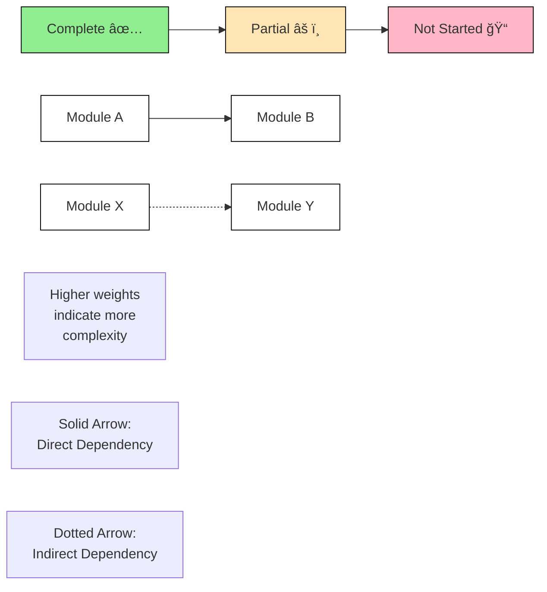

# 🎯 Retirement Planning Application - Project Progress & Plan

> <details>
> <summary><strong>🤖 AI Assistant Guide</strong></summary>
>
> ## Purpose
> This document tracks the progress and planning of the retirement planning application. It serves as the single source of truth for project status and implementation priorities.
>
> ## Document Structure
> 
> ### 1. Current Status & Next Steps
> This section is the primary reference point and should always be checked first.
> 
> #### Active Development
> - Lists tasks currently being worked on
> - Each task should include:
>   - Brief description of what's being done
>   - Link to detailed implementation plan if available
>   - Current subtasks or progress
>
> #### Ready to Implement
> Organized in three categories by dependency status:
> 1. **Technical Improvements** - No external dependencies
> 2. **Core Features** - Dependencies ready
> 3. **Cross-Cutting Features** - Partial dependencies
>
> Each entry should include:
> - Estimated duration (if known)
> - Link to detailed implementation plan if available
> - Current dependency status
>
> #### Blocked Items
> - Lists features that cannot be started
> - Must include what's blocking them
>
> ### 2. Module Dependencies
> The mermaid graph visualizes:
> - Module relationships (solid arrows = direct, dotted = indirect)
> - Module status (✅ Complete, ⚠️ Partial, 📝 Not Started)
> - Module weights for progress calculation
>
> ### 3. Implementation Status Table
> Shows detailed status of all modules:
> - Status indicators (✅, ⚠️, 📝)
> - Progress percentage
> - Dependencies
> - Brief notes
>
> ### 4. Project Milestones
> Each milestone includes:
> - Duration estimate
> - Current status
> - Key deliverables
> - Link to detailed implementation plan
>
> ## Working with this Document
>
> ### When Starting Work
> 1. Check "Current Status & Next Steps"
> 2. Review "Ready to Implement" section
> 3. Verify dependencies in the mermaid graph
> 4. Move selected task to "Active Development"
>
> ### When Updating Progress
> 1. Update relevant sections in this order:
>    - Active Development status
>    - Implementation Status table
>    - Module Dependencies graph
>    - Project Milestones
> 2. Recalculate overall progress if needed
> 3. Move completed tasks to appropriate sections
>
> ### When Adding New Tasks
> 1. Add detailed implementation plan in `docs/plans/`
> 2. Add to appropriate section:
>    - `active/` for immediate work
>    - `upcoming/` for planned work
> 3. Update "Ready to Implement" or "Blocked Items"
> 4. Update Implementation Status table
>
> ### Progress Calculation
> - Module progress based on completed features
> - Overall progress calculation:
>   ```
>   Sum of (Module Weight × Module Progress)
>   ```
> - Update progress percentages in Implementation Status table
>
> ### Documentation Organization
> - Active plans: `docs/plans/active/`
> - Upcoming plans: `docs/plans/upcoming/`
> - Technical docs: `docs/tech/`
> - Implementation details linked from this file
>
> ## Status Indicators
> - ✅ Complete: Fully implemented, tested, production-ready
> - ⚠️ Partial: Partially implemented or UI-only
> - 📝 Not Started: In planning phase
> - 🟡 In Progress: Currently being worked on
>
> ## Rules & Best Practices
> 1. Keep "Current Status & Next Steps" updated
> 2. Always verify dependencies before starting work
> 3. Link to detailed implementation plans
> 4. Use consistent status indicators
> 5. Update all affected sections when making changes
> 6. Never modify completed (✅) modules without explicit instruction
> </details>

## 📋 Current Status & Next Steps

### Active Development
- 🔥 **Form Reset Hook Implementation**
  - Create reusable hook to standardize form reset logic
  - Centralize data transformation between API and form formats
  - Handle complex nested data structures consistently
  > **Implementation Details**: [Form Reset Hook Plan](docs/plans/active/form_reset_hook.md)

- 🔥 **Pension Forms Standardization** (1-2 weeks)
  - Implement consistent layout across all pension forms
  - Standardize formatting patterns for numbers, currencies, and dates
  - Implement form reset hook for consistent data handling
  - Add proper error handling and loading states
  - Refactor ETF, Company, and Insurance pension forms
  > **Implementation Details**: [Pension Forms Standardization Plan](docs/plans/active/pension_forms_refactoring/README.md)

### Ready to Implement
Listed by priority and dependency readiness:

1. **Core Features** (Dependencies ready)
   - State Pension Implementation (Blocked by: Pension Forms Standardization)
   - Savings Pension Implementation (Blocked by: Pension Forms Standardization, State Pension)
   > **Details**: [Pension Plans Implementation](docs/plans/active/pension_plans.md)

2. **Cross-Cutting Features** (Partial dependencies)
   - Currency System Frontend Integration (1-2 weeks)
   - Internationalization Implementation (4-5 weeks)
   > **Details**: [Currency System Plan](docs/plans/active/currency_system.md) | [i18n Plan](docs/plans/active/internationalization.md)

### Blocked Items
- State Pension Implementation (Blocked by: Pension Forms Standardization)
- Savings Pension Implementation (Blocked by: Pension Forms Standardization, State Pension)
- Compass Module (Blocked by: Dashboard)
- Payout Strategy (Blocked by: Dashboard)
- Full Settings Implementation (Blocked by: i18n)

### Module Dependencies

```mermaid
graph TD
    %% Core Modules
    ETF[ETF Pension ✅<br/>Weight: 15%] --> D
    CP[Company Pension ✅<br/>Weight: 15%] --> D
    IP[Insurance Pension ✅<br/>Weight: 15%] --> D
    SP[State Pension 📝<br/>Weight: 10%] --> D
    SVP[Savings Pension 📝<br/>Weight: 10%] --> D
    D[Dashboard 📝<br/>Weight: 25%] --> C
    D --> PS
    
    %% Dependent Modules
    C[Compass 📝<br/>Weight: 25%]
    PS[Payout Strategy 📝<br/>Weight: 15%]
    
    %% Cross-Cutting Features
    CS[Currency System 📝<br/>Weight: 15%] --> S
    I18n[Internationalization 📝<br/>Weight: 20%] --> S
    
    %% Settings affects all modules
    S[Settings ⚠️<br/>Weight: 10%] -.-> ETF
    S -.-> CP
    S -.-> IP
    S -.-> SP
    S -.-> SVP
    S -.-> D
    S -.-> C
    S -.-> PS
    
    %% Household integration
    H[Household ✅<br/>Weight: 10%] -.-> ETF
    H -.-> CP
    H -.-> IP
    H -.-> SP
    H -.-> SVP
    
    %% Styling
    classDef complete fill:#90EE90,stroke:#000
    classDef partial fill:#FFE5B4,stroke:#000
    classDef notStarted fill:#FFB6C6,stroke:#000
    class ETF,H,CP,IP complete
    class S partial
    class SP,SVP,CS,I18n,D,C,PS notStarted
```

<details>
<summary><strong>📊 Graph Legend</strong></summary>



</details>
<br>

## 📊 Implementation Status `[Overall Progress: ~30%]`

| Module | Status | Progress | Dependencies | Notes |
|--------|---------|-----------|--------------|-------|
| ETF Pension | ✅ Complete | 100% | None | Basic CRUD + charts |
| Company Pension | ✅ Complete | 100% | None | Contribution tracking |
| Insurance Pension | ✅ Complete | 100% | None | Premium logic (needs standardization) |
| State Pension | 📝 Not Started | 0% | None | Payout tracking |
| Savings Pension | 📝 Not Started | 0% | None | Security-focused savings |
| Household | ✅ Complete | 100% | None | Basic CRUD |
| Settings | ⚠️ Partial | 50% | i18n | Config + validation |
| Dashboard | ⚠️ UI Only | 15% | All Pensions | Complex aggregation |
| Compass | ⚠️ UI Only | 10% | Dashboard | Advanced algorithms |
| Payout Strategy | ⚠️ UI Only | 10% | Dashboard | Financial modeling |
| Currency System Backend | ✅ Complete | 100% | None | Exchange rates + API |
| Currency System Frontend | 📝 Not Started | 0% | Settings | UI integration |
| Internationalization | 📝 Not Started | 0% | Settings | Full app coverage |

## 🎯 Project Milestones

### Milestone 1: Core Dashboard Implementation (4-6 weeks)
> **Status**: 🟡 Planning Phase
> **Details**: [Dashboard Implementation Plan](docs/plans/drafts/core_dashboard.md)

#### Key Deliverables:
1. Portfolio Overview
2. Contribution Tracking
3. Returns & Performance
4. Quick Actions & Integration

### Milestone 2: Complete Pension Plans (4-5 weeks)
> **Status**: 🟡 In Progress
> **Details**: [Pension Plans Implementation](docs/plans/active/pension_plans.md)

#### Key Deliverables:
1. ✅ Company Pension Implementation
2. State Pension Implementation
3. ✅ Insurance Pension Implementation
4. Savings Pension Implementation
5. ✅ ETF Pension Enhancements

### Milestone 3: Compass Implementation (4-5 weeks)
> **Status**: 🟡 Planning Phase
> **Details**: [Compass Implementation Plan](docs/plans/drafts/compass.md)

#### Key Deliverables:
1. Gap Analysis
2. Risk Assessment
3. Planning Tools

### Milestone 4: Payout Strategy Implementation (4-5 weeks)
> **Status**: 🟡 Planning Phase
> **Details**: [Payout Strategy Plan](docs/plans/drafts/payout_strategy.md)

#### Key Deliverables:
1. Basic Framework
2. Advanced Features
3. Guidance System

## 📚 Documentation Index
- [Technical Debt & Optimization](docs/tech/debt/README.md)
- [Testing Strategy & Status](docs/tech/testing/README.md)
- [Future Enhancements](docs/plans/future_enhancements.md)