# 🎯 Goldfinch - Projektstatus & Plan
Last Updated: 2026-02-21

## Zweck
Dieses Dokument ist die aktuelle, wartbare Statusquelle fuer Goldfinch.
Es ersetzt die alte React/Next.js-zentrierte Planung und verlinkt nur auf vorhandene Dokumente.

## Status-Legende
- `✅ Complete`: Implementiert und im aktuellen Code vorhanden
- `⚠️ Partial`: Implementiert, aber funktional eingeschraenkt oder noch MVP/Scaffold
- `🟡 In Progress`: Aktiv in Bearbeitung oder naechster Fokus
- `📝 Planned`: Geplant, aber noch nicht umgesetzt

## Aktueller Snapshot
- SvelteKit (`src/svelte-frontend`) ist der primaere Frontend-Pfad fuer neue Arbeit.
- Legacy-Frontend (`app/`, `src/frontend/`) ist noch vorhanden, aber nicht mehr der Zielpfad fuer Feature-Ausbau.
- Household-Management ist implementiert (CRUD inkl. UI und API-Integration).
- Pension-Management fuer alle 5 Typen ist implementiert (State, Company, Insurance, ETF, Savings; jeweils New/Edit-Flows).
- Settings inkl. Locale, Currency, Szenario-Raten, Inflation und Theme sind implementiert.
- Dashboard, Compass und Payout Strategy existieren aktuell als strukturierte MVP-Scaffolds mit "coming soon"-Anteilen.
- Exchange-Rate-Backend-Endpunkte sind verfuegbar (latest/historical/status/update).

## Aktiver Fokus (naechste Iterationen)
1. MVP-Ausbau fuer Dashboard, Compass und Payout Strategy mit echten Kernmetriken.
2. Frontend-Integration von Currency/Exchange-Rate-Flows in relevante UI-Bereiche.
3. Konsistenz-Harmonisierung im Backend (Status-/Statement-Endpunkte, Task-Flows).
4. Cutover-Vorbereitung: Svelte final als Standard, Legacy klar archivieren oder entfernen.

## Modulstatus

| Bereich | Status | Aktueller Stand | Naechster Schritt |
|---|---|---|---|
| Household | ✅ Complete | CRUD-Flow im Svelte-Frontend vorhanden | UX-Polish und Tests |
| Pension: State | ✅ Complete | New/Edit + Statements + Szenarien | Regression-Tests |
| Pension: Savings | ✅ Complete | New/Edit + Statements + Rates + Contribution-Plan | Regression-Tests |
| Pension: Company | ✅ Complete | New/Edit + Statements + Contribution-Flow | Regression-Tests |
| Pension: Insurance | ✅ Complete | New/Edit + Statements + Contribution-Flow | Regression-Tests |
| Pension: ETF | ✅ Complete | New/Edit + ETF-Suche + Charts + One-time-Investment | ETF-Flow weiter vereinfachen |
| Settings & i18n-Basis | ✅ Complete | Locale/Currency/Rate-Settings + DE/EN-Setup | i18n-Abdeckung ausbauen |
| Dashboard | ⚠️ Partial | Seite vorhanden, aktuell v. a. Scaffold | MVP-KPIs anbinden |
| Compass | ⚠️ Partial | Seite vorhanden, aktuell v. a. Scaffold | Gap-Calculator MVP |
| Payout Strategy | ⚠️ Partial | Seite vorhanden, aktuell v. a. Scaffold | Basisszenarien MVP |
| Currency Backend | ✅ Complete | Exchange-Rate-Endpunkte + Task-Trigger vorhanden | Frontend-Nutzung konsolidieren |
| Currency Frontend Integration | 🟡 In Progress | Settings-Basis vorhanden, End-to-end Nutzung unvollstaendig | UI-Integration in Kernseiten |
| Contribution Management Automation | 📝 Planned | Konzept dokumentiert | Iterative Umsetzung starten |
| Backend Task/Endpoint Consistency | 🟡 In Progress | Plaene vorhanden, Teilarbeit noetig | Harmonisierung abschliessen |
| Testing & QA | 📝 Planned | Basis vorhanden, aber kein durchgaengiger MVP-Testkorridor | Check-/Test-Standard etablieren |

## Abhaengigkeiten (vereinfacht)

```mermaid
graph TD
    H[Household ✅] --> P[Pension Domains ✅]
    P --> D[Dashboard ⚠️]
    D --> C[Compass ⚠️]
    D --> PS[Payout Strategy ⚠️]

    S[Settings & i18n ✅] -.-> P
    S -.-> D
    S -.-> C
    S -.-> PS

    XR[Exchange Rates Backend ✅] --> CF[Currency Frontend Integration 🟡]
    CF -.-> D
    CF -.-> C
    CF -.-> PS

    B[Backend Consistency 🟡] -.-> P
    B -.-> XR
```


## Milestones

### Milestone 1: Svelte Core Migration
`Status: ✅ Abgeschlossen (funktional)`

Enthaelt:
1. Svelte-Frontend-Basis
2. Household
3. Settings/i18n-Basis
4. Pension-Flows fuer alle 5 Typen

### Milestone 2: MVP Product Surfaces
`Status: 🟡 In Progress`

Enthaelt:
1. Dashboard MVP mit echten Kernzahlen
2. Compass MVP mit Gap-Logik
3. Payout-MVP mit Basis-Szenarien
4. Currency-Integration in sichtbare Nutzerfluesse

### Milestone 3: Backend-Harmonisierung und Cutover
`Status: 📝 Planned`

Enthaelt:
1. Task-/Endpoint-Konsistenz fuer langfristige Wartbarkeit
2. Svelte als finaler Standardpfad
3. Legacy-Bereinigung (archivieren oder entfernen)

## Simplification Playbook Alignment
| Phase | Status | Referenz |
|---|---|---|
| Phase 0: Freeze/Guardrails | 🟡 In Progress | [01_phase0_freeze_guardrails.md](docs/simplification-playbook/01_phase0_freeze_guardrails.md) |
| Phase 1: Svelte Tech Slim | 🟡 In Progress | [02_phase1_svelte_tech_slim.md](docs/simplification-playbook/02_phase1_svelte_tech_slim.md) |
| Phase 2: ETF Simplification | 🟡 In Progress | [03_phase2_etf_simplification.md](docs/simplification-playbook/03_phase2_etf_simplification.md) |
| Phase 3: MVP Pages | 📝 Planned | [04_phase3_mvp_pages.md](docs/simplification-playbook/04_phase3_mvp_pages.md) |
| Phase 4: Backend Consistency | 📝 Planned | [05_phase4_backend_tasks_consistency.md](docs/simplification-playbook/05_phase4_backend_tasks_consistency.md) |
| Phase 5: Cutover/Cleanup | 📝 Planned | [06_phase5_cutover_cleanup.md](docs/simplification-playbook/06_phase5_cutover_cleanup.md) |

Hinweis:
- Das formale Abschlussprotokoll der Phasen wird in [99_ABSCHLUSS.md](docs/simplification-playbook/99_ABSCHLUSS.md) gepflegt.

## Blocker und Risiken
1. Dualbetrieb (Legacy + Svelte) erhoeht Wartungsaufwand und Kontextwechsel.
2. MVP-Seiten sind noch nicht datengetrieben genug fuer produktive Entscheidungsunterstuetzung.
3. Task- und Endpoint-Harmonisierung im Backend ist noch nicht abgeschlossen.
4. Automatisierte End-to-end Regression ist aktuell nicht ausreichend formalisiert.

## Arbeitsregeln fuer Updates
1. Bei jeder Feature-Lieferung: Modulstatus + Milestone + ggf. Playbook-Phase aktualisieren.
2. Keine toten Links: nur vorhandene Dateien referenzieren.
3. Prozentwerte nur pflegen, wenn sie messbar und regelmaessig aktualisiert werden.
4. React/Next-spezifische Planinhalte nur noch in historischen Dokumenten halten.

## Verifikation (Standardbefehle)
Svelte-Checks:
```bash
cd /Users/axel/Coding/goldfinch-dev/src/svelte-frontend
npm run check
```

Backend-Tests:
```bash
cd /Users/axel/Coding/goldfinch-dev/src/backend
python3 -m pytest
```

## Dokumentationsindex (gueltig)
- [README.md](README.md)
- [frontend-overview.md](docs/frontend-overview.md)
- [file-map.md](docs/file-map.md)
- [svelte_migration_plan.md](docs/svelte_migration_plan.md)
- [contribution_management.md](docs/contribution_management.md)
- [backend_refactoring_plan.md](docs/backend_refactoring_plan.md)
- [task_monitoring_migration.md](docs/task_monitoring_migration.md)
- [simplification-playbook/00_START.md](docs/simplification-playbook/00_START.md)
- [simplification-playbook/99_ABSCHLUSS.md](docs/simplification-playbook/99_ABSCHLUSS.md)

