```mermaid
graph LR
    %% Status Legend
    L1[Complete ✅] --> L2[Partial ⚠️]
    L2 --> L3[Not Started 📝]
    
    %% Dependency Types
    D1[Module A] --> D2[Module B]
    D3[Module X] -.-> D4[Module Y]
    
    %% Styling
    classDef complete fill:#90EE90,stroke:#000
    classDef partial fill:#FFE5B4,stroke:#000
    classDef notStarted fill:#FFB6C6,stroke:#000
    class L1 complete
    class L2 partial
    class L3 notStarted
    
    %% Legend Labels
    style D1 fill:#fff,stroke:#000
    style D2 fill:#fff,stroke:#000
    style D3 fill:#fff,stroke:#000
    style D4 fill:#fff,stroke:#000
    
    %% Notes
    N1[Higher weights<br/>indicate more<br/>complexity]
    
    %% Labels
    Label1[Solid Arrow:<br/>Direct Dependency]
    Label2[Dotted Arrow:<br/>Indirect Dependency]
```

# 🎯 Retirement Planning Application - Project Progress & Plan

## 📋 Current Status & Next Steps

### Active Development
- None currently in progress

### Ready to Implement
1. 🔥 **Company Pension** (Highest Priority)
   - Already has UI and CRUD
   - Blocking Dashboard implementation
   - Next: Implement contribution management

2. 🔥 **Insurance Pension** (High Priority)
   - Currently at 0% progress
   - Also blocking Dashboard implementation
   - Next: Implement basic CRUD

3. 🔥 **Dashboard Core Features**
   - Blocked by: Company & Insurance Pension completion
   - Can start: Portfolio overview for ETF pensions only
   - Full implementation requires all pension types

### Blocked Items
- Compass Module (Blocked by: Dashboard)
- Payout Strategy (Blocked by: Dashboard)
- Full Settings Implementation (Blocked by: i18n)

### Implementation Order
1. Complete Company Pension
2. Start Insurance Pension implementation
3. Start Dashboard with ETF support (parallel track)
4. Complete Insurance Pension
5. Complete Dashboard with all pension types
6. Proceed with Compass

### Module Dependencies

```mermaid
graph TD
    %% Core Modules
    ETF[ETF Pension ✅<br/>Weight: 15%] --> D
    CP[Company Pension ⚠️<br/>Weight: 15%] --> D
    IP[Insurance Pension ⚠️<br/>Weight: 15%] --> D
    D[Dashboard 📝<br/>Weight: 25%] --> C
    D --> PS
    
    %% Dependent Modules
    C[Compass 📝<br/>Weight: 25%]
    PS[Payout Strategy 📝<br/>Weight: 15%]
    
    %% Cross-Cutting Features
    CS[Currency System 📝<br/>Weight: 15%] --> S
    I18n[Internationalization 📝<br/>Weight: 20%] --> S
    
    %% Settings affects all modules
    S[Settings ⚠️<br/>Weight: 10%] -.-> ETF
    S -.-> CP
    S -.-> IP
    S -.-> D
    S -.-> C
    S -.-> PS
    
    %% Household integration
    H[Household ✅<br/>Weight: 10%] -.-> ETF
    H -.-> CP
    H -.-> IP
    
    %% Styling
    classDef complete fill:#90EE90,stroke:#000
    classDef partial fill:#FFE5B4,stroke:#000
    classDef notStarted fill:#FFB6C6,stroke:#000
    class ETF,H complete
    class CP,IP,S partial
    class CS,I18n,D,C,PS notStarted
```

<strong>📊 Graph Legend</strong>

 

> 

> 
<strong>🤖 AI Assistant Guide</strong>

>
> **Quick Reference**:
> This is a project tracking document for a retirement planning application.
> 
> **Core Rules**:
> 1. Always check "Current Status & Next Steps" first - this is the source of truth
> 2. Use the mermaid graph to verify dependencies before any changes
> 3. Calculate progress accurately using module weights
> 4. Handle technical debt alongside feature work
> 5. Update all affected sections when making changes
> 6. Never modify completed modules (✅) without explicit instruction
> 
> ### 1. Status Indicators
> - ✅ Complete: All features implemented, tested, and ready for production
> - ⚠️ Partial: Some features implemented or UI-only implementation
> - 📝 Not Started: Planning phase or backlog
> 
> ### 2. Progress Calculation
> - Task level: Count completed checkboxes
> - Feature level: All tasks must be complete
> - Module level: Use weighted progress (see "Module Weights" in Implementation Status)
> - Overall: Apply module weights to calculate total
> 
> ### 3. Document Sections
> #### Primary Sections (In order of importance)
> 1. Current Status & Next Steps
>    - Active Development
>    - Ready to Implement
>    - Blocked Items
>    - Implementation Order
> 2. Module Dependencies (mermaid graph)
> 3. Implementation Status
> 4. Progress Overview
> 
> ### 4. Workflow
> #### When Starting Work:
> 1. Check Current Status section
> 2. Verify dependencies
> 3. Move task to Active Development
> 4. Resolve blockers
> 
> #### When Updating Progress:
> 1. Update task checkboxes
> 2. Update feature status
> 3. Recalculate progress
> 4. Update all related sections
> 
> #### When Handling Technical Debt:
> 1. Check debt items in affected module
> 2. Update test coverage
> 3. Update documentation
> 

## 📊 Implementation Status `[Overall Progress: ~18%]`

### Core Modules
[Module 1/6 Complete]

> 

> 
<strong>⚖️ Module Weights</strong>

>
> Weights are based on complexity, business logic, and scope:
> - High (25%): Dashboard, Compass
> - Medium (15%): Pension Plans, Payout Strategy, Currency System
> - Low (10%): Settings, Household
> - Cross-cutting (20%): Internationalization
> 

#### 1. 💰 Pension Plans Module

##### ETF Pension Management ✅
- [x] Basic CRUD operations
- [x] Contribution tracking
- [x] Value tracking
- [x] Basic projections
- [x] Historical performance charts

##### Company Pension ⚠️
- [x] CRUD operations
- [ ] Contribution management
- [ ] Value tracking
- [ ] Integration with projections

##### Insurance Pension ⚠️
- [ ] CRUD operations
- [ ] Premium management
- [ ] Value tracking
- [ ] Integration with projections

##### Cross-Pension Features 📝
> Detailed implementation plan: [Contribution Management System](TODO/contribution_management.md)
- [ ] Automated contribution management
  - Daily contribution realization
  - Special case handling (weekends, holidays)
  - Monitoring and error recovery
- [ ] Advanced value tracking
- [ ] Unified projection system

#### 2. 👨‍👩‍👧‍👦 Household Module ✅
- [x] Member CRUD operations
- [x] Birthday and retirement age tracking
- [x] Retirement date calculations
- [x] Member form validation
- [x] Integration with pension plans

#### 3. ⚙️ Settings Module ⚠️
##### Complete Features ✅
- [x] Locale selection UI
- [x] Currency selection UI
- [x] Projection rates configuration
- [x] Inflation rate settings
- [x] Settings persistence
- [x] Form validation

##### Missing Features ⚠️
###### Currency System (Frontend)
- [ ] Currency conversion UI components
- [ ] Display converted values across all views
- [ ] Format monetary values according to locale
- [ ] Handle currency changes in forms
- [ ] Real-time conversion updates

###### Internationalization System
- [ ] Translation management system
- [ ] Language file structure
- [ ] Dynamic text loading
- [ ] RTL support for applicable languages
- [ ] Date/time localization
- [ ] Number format localization

##### Complete Features ✅
###### Currency System (Backend)
- [x] Exchange rate service integration (ECB)
- [x] Real-time currency conversion API
- [x] Historical exchange rates tracking
- [x] Backend conversion utilities
- [x] Automatic daily updates
- [x] Fallback mechanisms
- [x] Error handling and monitoring

#### 4. 📈 Dashboard Module ⚠️

> Currently only UI mockup exists

##### Missing Components:
- [ ] Total portfolio value aggregation
- [ ] Contributions tracking system
- [ ] Investment returns calculations
- [ ] Quick actions functionality
- [ ] Historical charts implementation
- [ ] Retirement goal progress tracking
- [ ] Scenario analysis engine
- [ ] Personalized recommendations system

#### 5. 🧭 Compass Module ⚠️

> Currently only UI mockup exists

##### Missing Components:
- [ ] Gap analysis calculations
- [ ] Risk assessment system
- [ ] Smart recommendations engine
- [ ] Interactive planning tools
- [ ] Real-time impact calculations
- [ ] Data integration with pension plans

#### 6. 💸 Payout Strategy Module ⚠️

> Currently only UI mockup exists

##### Missing Components:
- [ ] Timeline visualization
- [ ] Market condition simulations
- [ ] Withdrawal strategies calculator
- [ ] Adaptive recommendations
- [ ] Life stage guidance system
- [ ] Portfolio rebalancing logic

### Cross-Cutting Features

#### 1. 💱 Currency System Frontend Integration `1-2 weeks`
> **Status**: 📝 Not Started

##### Frontend Components (Week 1)
- [ ] Create currency conversion hooks
- [ ] Implement currency formatting utilities
- [ ] Add currency selection persistence
- [ ] Create reusable currency display components

##### Application Integration (Week 1-2)
- [ ] Update pension value displays
- [ ] Modify contribution forms
- [ ] Adapt projection displays
- [ ] Update dashboard calculations

##### Testing & Validation (Week 2)
- [ ] Add component unit tests
- [ ] Implement integration tests
- [ ] Test currency switching
- [ ] Verify formatting across locales

#### 2. 🌐 Internationalization Implementation `4-5 weeks`
> **Status**: 📝 Not Started

##### Translation System Setup (Week 1)
- [ ] Set up i18n framework
- [ ] Create translation file structure
- [ ] Implement translation loading system
- [ ] Add language detection

##### Content Translation (Week 1-3)
- [ ] Extract all UI text
- [ ] Create base translation files
- [ ] Implement translation workflow
- [ ] Add translation validation

##### Application Integration (Week 3-4)
- [ ] Update all components
- [ ] Implement RTL support
- [ ] Add number formatting
- [ ] Implement date/time formatting

##### Testing & QA (Week 4-5)
- [ ] Test all supported languages
- [ ] Verify RTL layouts
- [ ] Test number/date formats
- [ ] Performance testing

## 📈 Progress Overview
> Last Updated: February 28, 2025
> Next Milestone: Core Dashboard Implementation

| Module | Status | Progress | Dependencies | Complexity Notes |
|--------|---------|-----------|--------------|-----------------|
| ETF Pension | ✅ Complete | 100% | None | Basic CRUD + charts |
| Company Pension | ⚠️ UI Only | 25% | None | Custom calculations |
| Insurance Pension | ⚠️ UI Only | 0% | None | Premium logic |
| Household | ✅ Complete | 100% | None | Basic CRUD |
| Settings | ⚠️ Partial | 50% | i18n | Config + validation |
| Dashboard | ⚠️ UI Only | 15% | All Pensions | Complex aggregation |
| Compass | ⚠️ UI Only | 10% | Dashboard | Advanced algorithms |
| Payout Strategy | ⚠️ UI Only | 10% | Dashboard | Financial modeling |
| Currency System (Backend) | ✅ Complete | 100% | None | Exchange rates + API |
| Currency System (Frontend) | 📝 Not Started | 0% | None | UI integration |
| Internationalization | 📝 Not Started | 0% | None | Full app coverage |

> 🎯 **Overall Progress**: ~18%
> 
> **Module Completion**:
> - 3 of 11 modules complete (ETF Pension, Household, Currency Backend)
> - 6 modules partially implemented
> - 2 modules not started
> - Technical Debt: Minimal coverage

## 🎯 Project Milestones

### Milestone 1: Core Dashboard Implementation `4-6 weeks`
> **Status**: 🟡 Planning Phase

#### 1. Portfolio Overview (Week 1-2)
- [ ] Implement data aggregation from all pension types
- [ ] Create total portfolio value calculator
- [ ] Build month/year-over-year growth calculator
- [ ] Add basic portfolio distribution chart

#### 2. Contribution Tracking (Week 2-3)
- [ ] Implement total contributions calculator
- [ ] Create year-to-date contributions tracker
- [ ] Add contribution history visualization
- [ ] Build contribution patterns analyzer

#### 3. Returns & Performance (Week 3-4)
- [ ] Implement investment returns calculator
- [ ] Create XIRR calculation system
- [ ] Build performance comparison tools
- [ ] Add historical performance charts

#### 4. Quick Actions & Integration (Week 4-6)
- [ ] Implement contribution recording system
- [ ] Create plan value update mechanism
- [ ] Add basic health check functionality
- [ ] Build notification system for updates

### Milestone 2: Complete Pension Plans `3-4 weeks`
> **Status**: 🟡 Planning Phase

#### 1. Company Pension Implementation (Week 1-2)
- [ ] Create CRUD operations
- [ ] Implement contribution management
- [ ] Add value tracking system
- [ ] Integrate with projections

#### 2. Insurance Pension Implementation (Week 2-3)
- [ ] Create CRUD operations
- [ ] Implement premium management
- [ ] Add value tracking system
- [ ] Integrate with projections

#### 3. ETF Pension Enhancements (Week 3-4)
- [ ] Improve error handling
- [ ] Add validation rules
- [ ] Enhance projection accuracy
- [ ] Optimize performance

### Milestone 3: Compass Implementation `4-5 weeks`
> **Status**: 🟡 Planning Phase

#### 1. Gap Analysis (Week 1-2)
- [ ] Create wage-based calculator
- [ ] Implement pension gap analyzer
- [ ] Build real-time update system
- [ ] Add comparison visualizations

#### 2. Risk Assessment (Week 2-3)
- [ ] Implement risk level calculator
- [ ] Create risk tolerance questionnaire
- [ ] Build risk visualization tools
- [ ] Add risk adjustment recommendations

#### 3. Planning Tools (Week 3-5)
- [ ] Create retirement age calculator
- [ ] Implement scenario simulator
- [ ] Build timeline visualizer
- [ ] Add impact analysis tools

### Milestone 4: Payout Strategy Implementation `4-5 weeks`
> **Status**: 🟡 Planning Phase

#### 1. Basic Framework (Week 1-2)
- [ ] Create withdrawal calculator
- [ ] Implement basic timeline visualization
- [ ] Build phase management system
- [ ] Add basic strategy comparison tools

#### 2. Advanced Features (Week 2-3)
- [ ] Implement market condition simulator
- [ ] Create tax efficiency calculator
- [ ] Build dynamic withdrawal system
- [ ] Add rebalancing tools

#### 3. Guidance System (Week 3-5)
- [ ] Create life stage analyzer
- [ ] Implement recommendation engine
- [ ] Build strategy optimization tools
- [ ] Add monitoring and alert system

## 🚀 Future Enhancements

### Phase 2 Features

#### 1. 📊 Advanced Analytics
- Machine learning for pattern recognition
- Predictive modeling for market conditions
- Advanced risk analysis tools

#### 2. 🔌 Integration Capabilities
- External financial account integration
- Tax system integration
- Market data feeds

#### 3. 🎨 Enhanced User Experience
- Mobile application
- Customizable dashboards
- Advanced visualization options

### Phase 3 Features

#### 1. 👥 Social Features
- Anonymous peer comparison
- Community insights
- Expert advice integration

#### 2. 📝 Advanced Planning
- Estate planning integration
- Healthcare cost planning
- Geographic cost-of-living analysis

## 🛠️ Technical Debt & Optimization

### Current Issues to Address

#### 1. ⚡ Performance Optimization
- [ ] Optimize database queries
- [ ] Implement caching system
- [ ] Improve front-end rendering

#### 2. 🔍 Code Quality
- [ ] Increase test coverage
- [ ] Improve error handling
- [ ] Add comprehensive logging

#### 3. 🔄 Task System Cleanup & Migration
> Detailed migration plan: [Task Monitoring Migration](TODO/task_monitoring_migration.md)

##### Current State Analysis
- [ ] Audit TaskStatus table usage
- [ ] Document dependencies on TaskStatus
- [ ] Map out migration path

##### Migration Tasks
- [ ] Create specialized tracking for ETF pension creation
- [ ] Update ETF pension processing to use new tracking
- [ ] Remove TaskStatus table
- [ ] Update affected documentation

#### 4. 🧪 Testing Implementation

##### Completed Tests ✅
1. **Context Testing**
   - [x] HouseholdContext test setup with Jest and React Testing Library
   - [x] Provider integration tests
   - [x] Hook usage tests
   - [x] Error handling tests
   - [x] State management tests
   - [x] API integration mocking

##### Priority Testing Areas

###### Immediate Testing Needs
1. **Complex Calculation Functions**
   - [ ] `calculateMemberFields` (household-helpers.ts) - age and retirement calculations
   - [ ] `generateFutureContributions` (contribution-plan.ts) - pension contribution projections
   - [ ] `analyzeContributionStep` (ContributionImpactAnalysis.tsx) - growth opportunities
   - [ ] `calculateProjection` (projection-preview.tsx) - financial projections with inflation

2. **Business Logic Validators**
   - [ ] `validateRetirementAges` (household-helpers.ts)
   - [ ] Pension validation schemas (validations/pension.ts)

3. **Data Transformation Functions**
   - [ ] `getContributionForDate` (projection-utils.ts)
   - [ ] `formatPensionSummary` (pension-helpers.ts)

###### Future Feature Testing Requirements
1. **Currency System Integration**
   - [ ] Currency conversion utilities
   - [ ] Currency formatting functions
   - [ ] Exchange rate calculations
   - [ ] Multi-currency portfolio aggregation

2. **Enhanced Projection & Analysis**
   - [ ] Multi-pension type projections
   - [ ] Market condition scenarios
   - [ ] Tax implication calculations
   - [ ] Inflation scenario handling
   - [ ] Gap analysis algorithms
   - [ ] Risk assessment calculations

3. **Advanced Contribution Management**
   - [ ] Company matching rules
   - [ ] Insurance premium patterns
   - [ ] Variable contribution schedules
   - [ ] Tax-limit validations
   - [ ] Cross-pension contribution optimization

4. **Payout Strategy Calculations**
   - [ ] Withdrawal calculation algorithms
   - [ ] Phase transition logic
   - [ ] Market condition simulation
   - [ ] Portfolio rebalancing functions
   - [ ] Tax-efficient withdrawal strategies

5. **Dashboard Data Aggregation**
   - [ ] Cross-pension portfolio aggregation
   - [ ] XIRR calculations
   - [ ] Performance comparison algorithms
   - [ ] Distribution analysis functions
   - [ ] Real-time update calculations

##### Test Infrastructure Setup ✅
- [x] Jest configuration for React components
- [x] React Testing Library setup
- [x] API mocking utilities
- [x] Test helper functions
- [ ] Setup CI/CD test pipeline
- [ ] Implement test coverage reporting
- [ ] Create testing documentation
- [ ] Setup automated test runs
- [ ] Configure test environments

##### Frontend Testing
- [x] Basic context testing patterns established
- [ ] Unit tests for React components (Jest + React Testing Library)
  - [ ] Form validation logic
  - [ ] Component state management
  - [ ] UI interactions and events
  - [ ] Currency formatting utilities
  - [ ] Date handling utilities
- [ ] Integration tests
  - [x] Context provider integration
  - [ ] User flows (form submissions, navigation)
  - [ ] API integration points
  - [ ] State management integration
- [ ] E2E tests (Cypress/Playwright)
  - [ ] Critical user journeys
  - [ ] Pension plan creation flow
  - [ ] Settings modification flow
  - [ ] Dashboard interactions
- [ ] Accessibility testing (axe-core)
- [ ] Performance testing (Lighthouse CI)

##### Backend Testing
- [ ] Unit tests (pytest)
  - [ ] Data models and schemas
  - [ ] Utility functions
  - [ ] Service layer logic
  - [ ] Currency conversion logic
- [ ] Integration tests
  - [ ] API endpoints
  - [ ] Database operations
  - [ ] External service integrations
- [ ] Load testing (k6)
  - [ ] API endpoint performance
  - [ ] Concurrent user simulation
  - [ ] Database query performance
- [ ] Security testing
  - [ ] Input validation
  - [ ] Authentication flows
  - [ ] API security headers

#### 6. 📚 Documentation
- [ ] Complete API documentation
- [ ] Add user guides
- [ ] Create maintenance documentation