# 🎯 Retirement Planning Application - Project Progress & Plan

## 📋 Current Status & Next Steps

### Active Development
- None currently in progress

### Ready to Implement
1. 🔥 **Company Pension** (Highest Priority)
   - Already has UI and CRUD
   - Blocking Dashboard implementation
   - Next: Implement contribution management

2. 🔥 **Dashboard Core Features**
   - Blocked by: Company & Insurance Pension completion
   - Can start: Portfolio overview for ETF pensions

3. 📝 **Currency System**
   - Required for accurate calculations
   - No blockers, can be started

### Blocked Items
- Compass Module (Blocked by: Dashboard)
- Payout Strategy (Blocked by: Dashboard)
- Full Settings Implementation (Blocked by: Currency, i18n)

### Implementation Order
1. Complete Company Pension
2. Start Dashboard with ETF support
3. Begin Currency System
4. Complete Insurance Pension
5. Finish Dashboard
6. Proceed with Compass

### Module Dependencies

```mermaid
graph TD
    %% Core Modules
    ETF[ETF Pension ✅<br/>Weight: 15%] --> D
    CP[Company Pension ⚠️<br/>Weight: 15%] --> D
    IP[Insurance Pension ⚠️<br/>Weight: 15%] --> D
    D[Dashboard ⚠️<br/>Weight: 25%] --> C
    D --> PS
    
    %% Dependent Modules
    C[Compass ⚠️<br/>Weight: 25%]
    PS[Payout Strategy ⚠️<br/>Weight: 15%]
    
    %% Cross-Cutting Features
    CS[Currency System 📝<br/>Weight: 15%] --> S
    I18n[Internationalization 📝<br/>Weight: 20%] --> S
    
    %% Settings affects all modules
    S[Settings ⚠️<br/>Weight: 10%] -.-> ETF
    S -.-> CP
    S -.-> IP
    S -.-> D
    S -.-> C
    S -.-> PS
    
    %% Household integration
    H[Household ✅<br/>Weight: 10%] -.-> ETF
    H -.-> CP
    H -.-> IP
    
    %% Styling
    classDef complete fill:#90EE90,stroke:#000
    classDef partial fill:#FFE5B4,stroke:#000
    classDef notStarted fill:#FFB6C6,stroke:#000
    class ETF,H complete
    class CP,IP,D,C,PS,S partial
    class CS,I18n notStarted
    
    %% Legend
    subgraph Legend
        L1[Complete ✅] --> L2[Partial ⚠️]
        L2 --> L3[Not Started 📝]
        L4[Direct Dependency] --> L5[Indirect Dependency]
        L4 --- L6[Dotted: Indirect<br/>Solid: Direct]
    end

    %% Notes
    subgraph Notes
        N1[Higher weights<br/>indicate more<br/>complexity]
    end
```

> 

> 
<strong>🤖 AI Assistant Guide</strong>

>
> **Quick Reference**:
> This is a project tracking document for a retirement planning application.
> 
> **Core Rules**:
> 1. Always check "Current Status & Next Steps" first - this is the source of truth
> 2. Use the mermaid graph to verify dependencies before any changes
> 3. Calculate progress accurately using module weights
> 4. Handle technical debt alongside feature work
> 5. Update all affected sections when making changes
> 6. Never modify completed modules (✅) without explicit instruction
> 
> ### 1. Status Indicators
> - ✅ Complete: All features implemented, tested, and ready for production
> - ⚠️ Partial: Some features implemented or UI-only implementation
> - 📝 Not Started: Planning phase or backlog
> 
> ### 2. Progress Calculation
> - Task level: Count completed checkboxes
> - Feature level: All tasks must be complete
> - Module level: Use weighted progress (see "Module Weights" in Implementation Status)
> - Overall: Apply module weights to calculate total
> 
> ### 3. Document Sections
> #### Primary Sections (In order of importance)
> 1. Current Status & Next Steps
>    - Active Development
>    - Ready to Implement
>    - Blocked Items
>    - Implementation Order
> 2. Module Dependencies (mermaid graph)
> 3. Implementation Status
> 4. Progress Overview
> 
> ### 4. Workflow
> #### When Starting Work:
> 1. Check Current Status section
> 2. Verify dependencies
> 3. Move task to Active Development
> 4. Resolve blockers
> 
> #### When Updating Progress:
> 1. Update task checkboxes
> 2. Update feature status
> 3. Recalculate progress
> 4. Update all related sections
> 
> #### When Handling Technical Debt:
> 1. Check debt items in affected module
> 2. Update test coverage
> 3. Update documentation
> 

## 📊 Implementation Status `[Overall Progress: ~18%]`

### Core Modules
[Module 1/6 Complete]

> 

> 
<strong>⚖️ Module Weights</strong>

>
> Weights are based on complexity, business logic, and scope:
> - High (25%): Dashboard, Compass
> - Medium (15%): Pension Plans, Payout Strategy, Currency System
> - Low (10%): Settings, Household
> - Cross-cutting (20%): Internationalization
> 

#### 1. 💰 Pension Plans Module

##### ETF Pension Management ✅
- [x] Basic CRUD operations
- [x] Contribution tracking
- [x] Value tracking
- [x] Basic projections
- [x] Historical performance charts

##### Company Pension ⚠️
- [x] CRUD operations
- [ ] Contribution management
- [ ] Value tracking
- [ ] Integration with projections

##### Insurance Pension ⚠️
- [ ] CRUD operations
- [ ] Premium management
- [ ] Value tracking
- [ ] Integration with projections

#### 2. 👨‍👩‍👧‍👦 Household Module ✅
- [x] Member CRUD operations
- [x] Birthday and retirement age tracking
- [x] Retirement date calculations
- [x] Member form validation
- [x] Integration with pension plans

#### 3. ⚙️ Settings Module ⚠️
##### Complete Features ✅
- [x] Locale selection UI
- [x] Currency selection UI
- [x] Projection rates configuration
- [x] Inflation rate settings
- [x] Settings persistence
- [x] Form validation

##### Missing Features ⚠️
###### Currency System
- [ ] Exchange rate service integration
- [ ] Real-time currency conversion
- [ ] Historical exchange rates tracking
- [ ] Currency conversion for all monetary values
- [ ] Currency format handling across the app

###### Internationalization System
- [ ] Translation management system
- [ ] Language file structure
- [ ] Dynamic text loading
- [ ] RTL support for applicable languages
- [ ] Date/time localization
- [ ] Number format localization

#### 4. 📈 Dashboard Module ⚠️

> Currently only UI mockup exists

##### Missing Components:
- [ ] Total portfolio value aggregation
- [ ] Contributions tracking system
- [ ] Investment returns calculations
- [ ] Quick actions functionality
- [ ] Historical charts implementation
- [ ] Retirement goal progress tracking
- [ ] Scenario analysis engine
- [ ] Personalized recommendations system

#### 5. 🧭 Compass Module ⚠️

> Currently only UI mockup exists

##### Missing Components:
- [ ] Gap analysis calculations
- [ ] Risk assessment system
- [ ] Smart recommendations engine
- [ ] Interactive planning tools
- [ ] Real-time impact calculations
- [ ] Data integration with pension plans

#### 6. 💸 Payout Strategy Module ⚠️

> Currently only UI mockup exists

##### Missing Components:
- [ ] Timeline visualization
- [ ] Market condition simulations
- [ ] Withdrawal strategies calculator
- [ ] Adaptive recommendations
- [ ] Life stage guidance system
- [ ] Portfolio rebalancing logic

### Cross-Cutting Features

#### 1. 💱 Currency System Implementation `3-4 weeks`
> **Status**: 📝 Not Started

##### Currency Service Setup (Week 1)
- [ ] Set up exchange rate API integration
- [ ] Implement rate caching system
- [ ] Create rate update scheduler
- [ ] Add fallback mechanisms

##### Core Conversion System (Week 1-2)
- [ ] Create currency conversion service
- [ ] Implement conversion helpers
- [ ] Add historical rate tracking
- [ ] Create conversion audit system

##### Application Integration (Week 2-3)
- [ ] Update pension value displays
- [ ] Modify contribution handling
- [ ] Adapt projection calculations
- [ ] Update dashboard calculations

##### Testing & Optimization (Week 3-4)
- [ ] Add conversion unit tests
- [ ] Implement integration tests
- [ ] Optimize rate caching
- [ ] Add performance monitoring

#### 2. 🌐 Internationalization Implementation `4-5 weeks`
> **Status**: 📝 Not Started

##### Translation System Setup (Week 1)
- [ ] Set up i18n framework
- [ ] Create translation file structure
- [ ] Implement translation loading system
- [ ] Add language detection

##### Content Translation (Week 1-3)
- [ ] Extract all UI text
- [ ] Create base translation files
- [ ] Implement translation workflow
- [ ] Add translation validation

##### Application Integration (Week 3-4)
- [ ] Update all components
- [ ] Implement RTL support
- [ ] Add number formatting
- [ ] Implement date/time formatting

##### Testing & QA (Week 4-5)
- [ ] Test all supported languages
- [ ] Verify RTL layouts
- [ ] Test number/date formats
- [ ] Performance testing

## 📈 Progress Overview
> Last Updated: February 28, 2025
> Next Milestone: Core Dashboard Implementation

| Module | Status | Progress | Dependencies | Complexity Notes |
|--------|---------|-----------|--------------|-----------------|
| ETF Pension | ✅ Complete | 100% | None | Basic CRUD + charts |
| Company Pension | ⚠️ UI Only | 25% | None | Custom calculations |
| Insurance Pension | ⚠️ UI Only | 0% | None | Premium logic |
| Household | ✅ Complete | 100% | None | Basic CRUD |
| Settings | ⚠️ Partial | 50% | Currency, i18n | Config + validation |
| Dashboard | ⚠️ UI Only | 15% | All Pensions | Complex aggregation |
| Compass | ⚠️ UI Only | 10% | Dashboard | Advanced algorithms |
| Payout Strategy | ⚠️ UI Only | 10% | Dashboard | Financial modeling |
| Currency System | 📝 Not Started | 0% | None | Real-time rates |
| Internationalization | 📝 Not Started | 0% | None | Full app coverage |

> 🎯 **Overall Progress**: ~18%
> 
> **Module Completion**:
> - 2 of 10 modules complete (ETF Pension, Household)
> - 6 modules partially implemented
> - 2 modules not started
> - Technical Debt: Minimal coverage

## 🎯 Project Milestones

### Milestone 1: Core Dashboard Implementation `4-6 weeks`
> **Status**: 🟡 Planning Phase

#### 1. Portfolio Overview (Week 1-2)
- [ ] Implement data aggregation from all pension types
- [ ] Create total portfolio value calculator
- [ ] Build month/year-over-year growth calculator
- [ ] Add basic portfolio distribution chart

#### 2. Contribution Tracking (Week 2-3)
- [ ] Implement total contributions calculator
- [ ] Create year-to-date contributions tracker
- [ ] Add contribution history visualization
- [ ] Build contribution patterns analyzer

#### 3. Returns & Performance (Week 3-4)
- [ ] Implement investment returns calculator
- [ ] Create XIRR calculation system
- [ ] Build performance comparison tools
- [ ] Add historical performance charts

#### 4. Quick Actions & Integration (Week 4-6)
- [ ] Implement contribution recording system
- [ ] Create plan value update mechanism
- [ ] Add basic health check functionality
- [ ] Build notification system for updates

### Milestone 2: Complete Pension Plans `3-4 weeks`
> **Status**: 🟡 Planning Phase

#### 1. Company Pension Implementation (Week 1-2)
- [ ] Create CRUD operations
- [ ] Implement contribution management
- [ ] Add value tracking system
- [ ] Integrate with projections

#### 2. Insurance Pension Implementation (Week 2-3)
- [ ] Create CRUD operations
- [ ] Implement premium management
- [ ] Add value tracking system
- [ ] Integrate with projections

#### 3. ETF Pension Enhancements (Week 3-4)
- [ ] Improve error handling
- [ ] Add validation rules
- [ ] Enhance projection accuracy
- [ ] Optimize performance

### Milestone 3: Compass Implementation `4-5 weeks`
> **Status**: 🟡 Planning Phase

#### 1. Gap Analysis (Week 1-2)
- [ ] Create wage-based calculator
- [ ] Implement pension gap analyzer
- [ ] Build real-time update system
- [ ] Add comparison visualizations

#### 2. Risk Assessment (Week 2-3)
- [ ] Implement risk level calculator
- [ ] Create risk tolerance questionnaire
- [ ] Build risk visualization tools
- [ ] Add risk adjustment recommendations

#### 3. Planning Tools (Week 3-5)
- [ ] Create retirement age calculator
- [ ] Implement scenario simulator
- [ ] Build timeline visualizer
- [ ] Add impact analysis tools

### Milestone 4: Payout Strategy Implementation `4-5 weeks`
> **Status**: 🟡 Planning Phase

#### 1. Basic Framework (Week 1-2)
- [ ] Create withdrawal calculator
- [ ] Implement basic timeline visualization
- [ ] Build phase management system
- [ ] Add basic strategy comparison tools

#### 2. Advanced Features (Week 2-3)
- [ ] Implement market condition simulator
- [ ] Create tax efficiency calculator
- [ ] Build dynamic withdrawal system
- [ ] Add rebalancing tools

#### 3. Guidance System (Week 3-5)
- [ ] Create life stage analyzer
- [ ] Implement recommendation engine
- [ ] Build strategy optimization tools
- [ ] Add monitoring and alert system

## 🚀 Future Enhancements

### Phase 2 Features

#### 1. 📊 Advanced Analytics
- Machine learning for pattern recognition
- Predictive modeling for market conditions
- Advanced risk analysis tools

#### 2. 🔌 Integration Capabilities
- External financial account integration
- Tax system integration
- Market data feeds

#### 3. 🎨 Enhanced User Experience
- Mobile application
- Customizable dashboards
- Advanced visualization options

### Phase 3 Features

#### 1. 👥 Social Features
- Anonymous peer comparison
- Community insights
- Expert advice integration

#### 2. 📝 Advanced Planning
- Estate planning integration
- Healthcare cost planning
- Geographic cost-of-living analysis

## 🛠️ Technical Debt & Optimization

### Current Issues to Address

#### 1. ⚡ Performance Optimization
- [ ] Optimize database queries
- [ ] Implement caching system
- [ ] Improve front-end rendering

#### 2. 🔍 Code Quality
- [ ] Increase test coverage
- [ ] Improve error handling
- [ ] Add comprehensive logging

#### 3. 🧪 Testing Implementation
##### Frontend Testing
- [ ] Unit tests for React components (Jest + React Testing Library)
  - [ ] Form validation logic
  - [ ] Component state management
  - [ ] UI interactions and events
  - [ ] Currency formatting utilities
  - [ ] Date handling utilities
- [ ] Integration tests
  - [ ] User flows (form submissions, navigation)
  - [ ] API integration points
  - [ ] State management integration
- [ ] E2E tests (Cypress/Playwright)
  - [ ] Critical user journeys
  - [ ] Pension plan creation flow
  - [ ] Settings modification flow
  - [ ] Dashboard interactions
- [ ] Accessibility testing (axe-core)
- [ ] Performance testing (Lighthouse CI)

##### Backend Testing
- [ ] Unit tests (pytest)
  - [ ] Data models and schemas
  - [ ] Utility functions
  - [ ] Service layer logic
  - [ ] Currency conversion logic
- [ ] Integration tests
  - [ ] API endpoints
  - [ ] Database operations
  - [ ] External service integrations
- [ ] Load testing (k6)
  - [ ] API endpoint performance
  - [ ] Concurrent user simulation
  - [ ] Database query performance
- [ ] Security testing
  - [ ] Input validation
  - [ ] Authentication flows
  - [ ] API security headers

##### Test Infrastructure
- [ ] Setup CI/CD test pipeline
- [ ] Implement test coverage reporting
- [ ] Create testing documentation
- [ ] Setup automated test runs
- [ ] Configure test environments

> **Target Coverage**: 
> - Frontend: 80% for components, 90% for utilities
> - Backend: 90% for models/services, 85% for API endpoints

#### 4. 📚 Documentation
- [ ] Complete API documentation
- [ ] Add user guides
- [ ] Create maintenance documentation

graph TD
    ETF[ETF Pension ✅] --> D[Dashboard ⚠️]
    CP[Company Pension ⚠️] --> D
    IP[Insurance Pension ⚠️] --> D
    D --> C[Compass ⚠️]
    D --> PS[Payout Strategy ⚠️]
    CS[Currency System 📝] --> S[Settings ⚠️]
    I18n[Internationalization 📝] --> S 