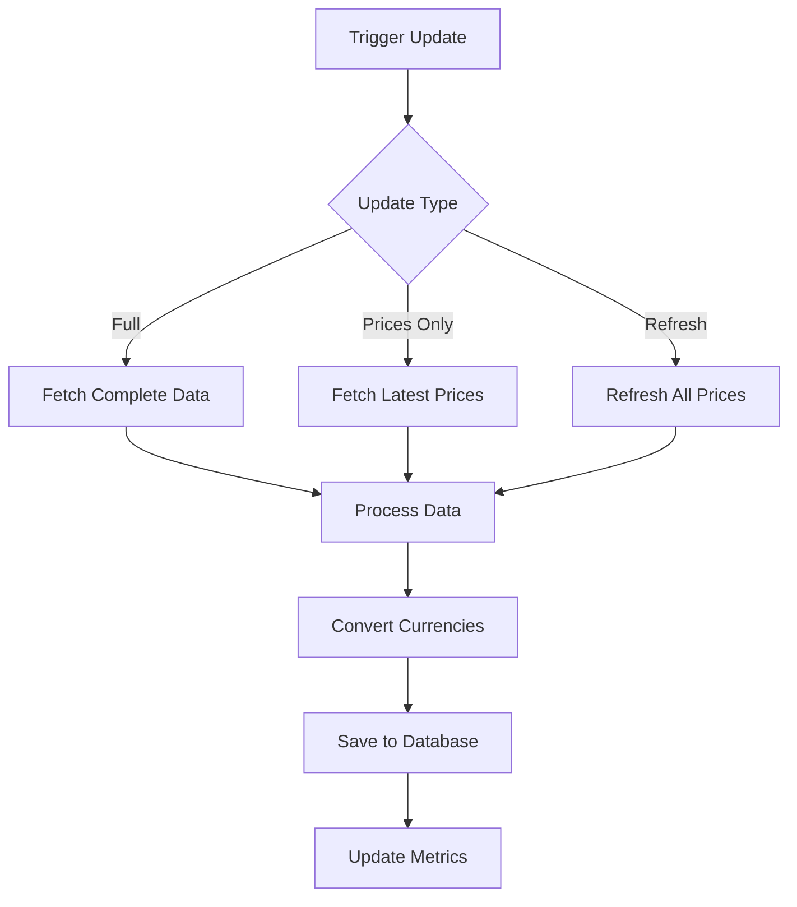

# ETF Service Internal Documentation

## Architecture Overview

The ETF service is built on several key components that work together to provide ETF data management and price tracking:

### Core Components

1. ETF Service (`etf_service.py`)
   - Main service implementation
   - Handles ETF data updates
   - Manages price updates
   - Implements currency conversion

2. ETF CRUD (`crud/etf.py`)
   - Database operations
   - Price management
   - Error tracking
   - Exchange rate integration

3. Celery Tasks (`tasks/etf.py`)
   - Asynchronous processing
   - Scheduled updates
   - Error handling
   - Maintenance tasks

4. Models (`models/etf.py`)
   - ETF data structure
   - Price history
   - Update tracking
   - Error logging

## Implementation Details

### Data Processing Flow

1. ETF Data Update


2. Price Processing
   - Chunks of 90 days for memory efficiency
   - Automatic currency conversion to EUR
   - Price validation and error tracking
   - Bulk database operations

3. Error Handling
   - Retry mechanism for transient failures
   - Error logging and categorization
   - Exchange rate error tracking
   - Missing data management

### Currency Conversion

1. Process Flow
   ```python
   def _convert_to_eur(price, currency, date):
       # Special handling for GBp
       if currency == "GBp":
           price = price / 100
           currency = "GBP"
       
       # Get exchange rate
       rate = get_exchange_rate(currency, date)
       
       # Convert price
       return price * rate
   ```

2. Exchange Rate Integration
   - Uses ECB exchange rates
   - Fallback to nearest available rate
   - Error tracking for missing rates
   - Special handling for GBp/GBP

### Performance Optimization

1. Database Indices
   ```sql
   CREATE INDEX ix_etf_prices_etf_id_date ON etf_prices(etf_id, date);
   CREATE INDEX ix_etf_updates_status_completed ON etf_updates(status, completed_at);
   CREATE INDEX ix_etf_errors_resolved ON etf_errors(resolved, resolved_at);
   ```

2. Batch Processing
   - 90-day chunks for price updates
   - Bulk inserts for price data
   - Efficient memory usage
   - Transaction management

## Maintenance Procedures

### Daily Operations

1. Price Updates
   ```python
   # Update latest prices for all active ETFs
   for etf in get_active_etfs():
       update_latest_prices(etf.id)
   ```

2. Error Monitoring
   ```python
   # Check for unresolved errors
   errors = get_unresolved_errors()
   for error in errors:
       process_error(error)
   ```

3. Data Validation
   ```python
   # Validate recent updates
   for update in get_recent_updates():
       validate_update(update)
   ```

### Weekly Operations

1. Full Refresh
   ```python
   # Refresh complete data for ETFs with issues
   for etf in get_etfs_with_issues():
       refresh_etf_data(etf.id)
   ```

2. Performance Check
   ```python
   # Check database performance
   analyze_table_statistics()
   check_index_usage()
   ```

### Monthly Operations

1. Data Cleanup
   ```python
   # Clean up old update records
   cleanup_old_updates()
   
   # Archive old error logs
   archive_old_errors()
   ```

2. System Health Check
   ```python
   # Verify system health
   check_database_size()
   verify_data_integrity()
   analyze_api_performance()
   ```

## Troubleshooting Guide

### Common Issues

1. Missing Prices
   - Check YFinance API status
   - Verify exchange rate availability
   - Check for API rate limits
   - Review error logs

2. Currency Conversion Errors
   - Verify exchange rate data
   - Check currency format
   - Review conversion logs
   - Check for missing rates

3. Performance Issues
   - Monitor chunk processing
   - Check database indices
   - Review query performance
   - Analyze memory usage

### Debug Tools

1. Status Check
   ```python
   # Check ETF update status
   status = get_etf_status(etf_id)
   print(f"Status: {status}")
   ```

2. Error Analysis
   ```python
   # Analyze error patterns
   errors = analyze_errors(etf_id)
   print(f"Error patterns: {errors}")
   ```

3. Performance Monitoring
   ```python
   # Monitor update performance
   metrics = get_update_metrics()
   print(f"Performance metrics: {metrics}")
   ```

## Development Guidelines

### Code Structure

1. Service Layer
   - Business logic implementation
   - Error handling
   - Data validation
   - Service coordination

2. CRUD Layer
   - Database operations
   - Data access patterns
   - Transaction management
   - Query optimization

3. Task Layer
   - Asynchronous processing
   - Scheduled operations
   - Background tasks
   - Error recovery

### Testing Strategy

1. Unit Tests
   - Service functions
   - CRUD operations
   - Data validation
   - Error handling

2. Integration Tests
   - API endpoints
   - Database operations
   - Currency conversion
   - Task execution

3. Performance Tests
   - Large data sets
   - Concurrent operations
   - Memory usage
   - Response times 