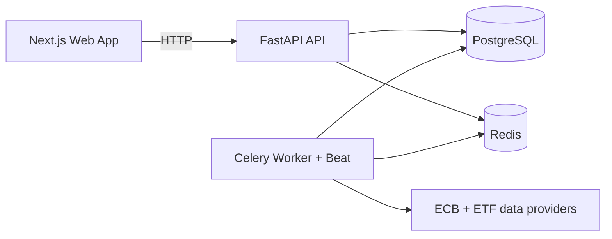

# 01 Architecture and Scope

Status: 🟡 Planning

## 1. Primary Goal

Rebuild Goldfinch into a cleaner, maintainable architecture that still ships quickly as a **local-only MVP**.

This is not a theoretical rewrite. It is a practical migration path that keeps momentum and protects existing domain value.

## 2. Constraints Driving Architecture

1. Runs in local infrastructure (Proxmox LXC target).
2. Sensitive data remains local.
3. ETF and exchange-rate capabilities are mandatory in MVP.
4. Background processing is mandatory in MVP.
5. Solo/small-team development productivity is critical.

## 3. Architectural Principles

1. Monorepo with strict in-repo boundaries.
2. Keep operational footprint small.
3. Prefer incremental refactor over broad speculative redesign.
4. Minimize moving parts unless they solve a real pain.
5. Security defaults: local network only, no unnecessary egress.

## 4. Recommended Target Architecture

## 5. Why This Architecture

1. Keeps frontend/backend separated logically without multi-repo overhead.
2. Keeps asynchronous job capabilities required for ETF + FX updates.
3. Uses Redis as the only broker/cache primitive for simpler operations.
4. Supports scaling inside one machine later (separate worker process/container).

## 6. Decisions: Keep vs Remove

### Keep

1. Next.js + React + TypeScript frontend.
2. FastAPI backend with SQLAlchemy + Alembic.
3. Background job concept (scheduled + manual triggers).
4. Existing pension domain model as starting point.

### Replace / Simplify

1. RabbitMQ -> Redis (MVP operations simplification).
2. Hardcoded infrastructure endpoints -> `.env` configuration.
3. Overly broad startup task orchestration -> explicit scheduled/manual jobs.
4. Heuristic request transformations in frontend API client -> explicit typed mappers.

### Remove for MVP

1. Enterprise telemetry stack.
2. Complex multi-environment release process.
3. Multi-repo contract publishing pipeline.
4. Non-essential domain abstractions not needed for current use cases.

## 7. Scope Boundaries

### In Scope (MVP)

1. Household CRUD.
2. Pension CRUD (ETF, company, insurance, state, savings) with statements.
3. ETF data updates + price refresh workflows.
4. Exchange rate updates + conversion usage in calculations.
5. Dashboard with key financial aggregates.
6. Local deployment and backup/restore.

### Not In Scope (MVP)

1. Public internet deployment.
2. User/team auth model.
3. Full Compass/Payout advanced modeling.
4. Data science/ML features.

## 8. Risk Register (Architecture Level)

1. Job orchestration complexity grows too early.
  Mitigation: only implement daily + manual trigger jobs first.
2. API schema churn breaks frontend repeatedly.
  Mitigation: lock DTO contracts per iteration.
3. Rebuild scope drifts toward full greenfield rewrite.
  Mitigation: iteration gates and explicit out-of-scope list.
4. Local deployment friction in LXC.
  Mitigation: treat deployment docs/scripts as part of MVP, not post-MVP.

## 9. Architecture Completion Criteria

1. All runtime services start with one compose command.
2. Frontend and backend have clear boundary contracts.
3. ETF/FX jobs run via scheduler and manual endpoint trigger.
4. No hardcoded credentials/hosts in source code.
5. Build and smoke tests pass on local dev and LXC target.

