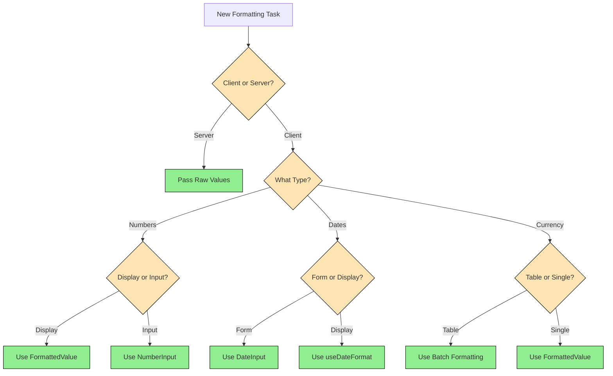
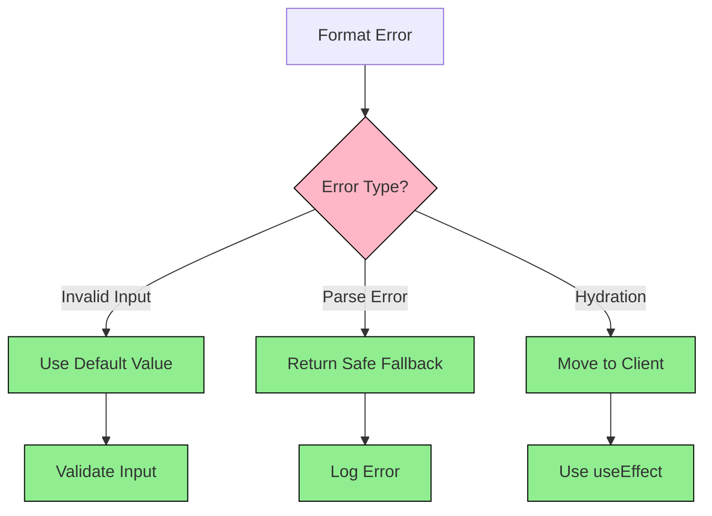

# Formatting & Date Handling Best Practices

> <details>
> <summary><strong>🤖 AI Assistant Guide</strong></summary>
>
> ## Purpose
> This document serves as the definitive guide for implementing formatting and date handling across the application. It ensures consistency in number, currency, and date formatting while preventing common issues like hydration mismatches.
>
> ## Document Structure
>
> ### 1. Quick Reference Map
> - Import statements and core utilities
> - Direct links to commonly used functions
> - Core decision rules for quick decisions
>
> ### 2. Core Implementation Patterns
> - Client-Side Formatting
> - Form Input Handling
> - Date Processing
> - Each pattern includes:
>   - Complete code example
>   - Use cases
>   - Common pitfalls
>
> ### 3. Type Definitions & Utilities
> - Core interfaces
> - Utility functions
> - Type guards
> - Validation patterns
>
> ### 4. Performance Considerations
> - Caching strategies
> - Batch updates
> - Memoization patterns
>
> ## Decision Making Guide
>
> ### When Implementing Formatting
> 1. Check if client-side or server-side
> 2. Verify locale requirements
> 3. Consider hydration implications
> 4. Choose appropriate pattern
>
> ### When Handling Forms
> 1. Use provided form components
> 2. Implement proper validation
> 3. Handle parsing/formatting
> 4. Consider performance
>
> ### When Processing Dates
> 1. Use safe date utilities
> 2. Implement proper validation
> 3. Handle timezone considerations
> 4. Use type guards
>
> ## Status Indicators
> - ✅ Recommended Pattern
> - ❌ Anti-Pattern
> - ⚠️ Use with Caution
>
> ## Rules & Best Practices
> 1. Never format directly in JSX
> 2. Always use client components for formatting
> 3. Handle all error cases
> 4. Follow locale conventions
> 5. Use type-safe interfaces
> 6. Cache formatters when possible
> </details>

### Quick Reference Map
```typescript
// 1. Form Date Handling
import { DateInput, DateEndPicker } from '@/frontend/components/ui'
import { useDateFormat } from '@/frontend/hooks/useDateFormat'

// 2. Date Processing
import { toDateObject, toISODateString, formatDisplayDate } from '@/frontend/lib/dateUtils'

// 3. Number/Currency Formatting
import { formatNumber, formatCurrency, formatPercent, formatNumberInput, safeNumberValue } from '@/frontend/lib/transforms'
```

### Core Decision Rules
1. **Forms**: Always use `DateInput` or `DateEndPicker`
2. **Client Components**: Use `useDateFormat` hook
3. **Server Components**: Pass raw values to client components
4. **Data Processing**: Use `dateUtils.ts` functions
5. **Number Formatting**: Use `transforms.ts` functions
6. **Number Input Handling**: Use `formatNumberInput` and `parseNumber` for bidirectional conversion

## Core Components & Utilities

### 1. Form Components

#### DateInput
```typescript
<FormField
  control={form.control}
  name="start_date"
  render={({ field }) => (
    <DateInput 
      field={field} 
      label="Start Date" 
    />
  )}
/>
```

#### DateEndPicker (with duration options)
```typescript
<FormField
  control={form.control}
  name="end_date"
  render={({ field }) => (
    <DateEndPicker
      field={field}
      startDate={startDate}
      retirementDate={retirementDate}
      durations={[
        { years: 1, label: '+1 Year' },
        { years: 5, label: '+5 Years' }
      ]}
    />
  )}
/>
```

### 2. Date Utilities

```typescript
// Convert to Date object
const date = toDateObject("2024-03-15") // Returns Date or null

// Format for display
const display = formatDisplayDate(date, 'de-DE') // Returns "15.03.2024"

// Convert to ISO string
const iso = toISODateString(date) // Returns "2024-03-15"
```

### 3. Number Formatting

```typescript
// Currency
const amount = formatCurrency(1234.56, {
  locale: 'de-DE',
  currency: 'EUR'
}).formatted // Returns "1.234,56 €"

// Currency with custom position (advanced)
const customAmount = formatCurrency(1234.56, {
  locale: 'de-DE',
  currency: 'EUR',
  currencyPosition: 'prefix' // Override locale default
}).formatted // Returns "€ 1.234,56"

// Percentage
const rate = formatPercent(0.1234, {
  locale: 'de-DE',
  decimals: 1
}).formatted // Returns "12,3%"

// Number Input Formatting
const inputValue = formatNumberInput(1234.56, 'de-DE') // Returns "1234,56"
const parsedValue = parseNumber("1234,56", 'de-DE') // Returns 1234.56
```

> **Note**: Currency symbol position defaults to locale-specific conventions. Only override `currencyPosition` if you need to deviate from the locale standard.

## Best Practices

### 1. Client-Side Formatting
```typescript
"use client"

function DisplayComponent({ value }) {
  const [formatted, setFormatted] = useState("")
  const { settings } = useSettings()

  useEffect(() => {
    setFormatted(formatCurrency(value, {
      locale: settings.number_locale,
      currency: settings.currency
    }).formatted)
  }, [value, settings])

  return <div>{formatted}</div>
}
```

### 2. Form Date Handling
```typescript
// Always use DateInput for consistent behavior
// ❌ Don't use native date input
<input type="date" /> // Wrong

// ✅ Use DateInput component
<DateInput field={field} /> // Correct
```

### 3. Type Safety
```typescript
// Always use type-safe interfaces
interface SafeNumber {
  formatted: string;
  value: number;
}

// Use type guards for date validation
if (isValidDate(value)) {
  // Safe to use date methods
}
```

## Common Pitfalls

### 1. Hydration Mismatches
❌ Don't format directly in JSX
```typescript
// Wrong
return <div>{formatCurrency(value)}</div>
```

✅ Use client-side formatting
```typescript
// Correct
const [formatted, setFormatted] = useState("")
useEffect(() => {
  setFormatted(formatCurrency(value))
}, [value])
```

### 2. Date Handling
❌ Don't manipulate dates directly
```typescript
// Wrong
const date = new Date(someValue)
```

✅ Use safe utilities
```typescript
// Correct
const date = toDateObject(someValue)
if (date) {
  // Safe to use
}
```

### 3. Form Integration
❌ Don't mix form libraries
```typescript
// Wrong
const [date, setDate] = useState()
```

✅ Use react-hook-form consistently
```typescript
// Correct
const form = useForm()
```

## Migration Notes
- `formatDate` in `transforms.ts` is deprecated
- Use `formatDisplayDate` from `dateUtils.ts` instead
- Always use form components for date inputs
- Check `isValidDate` before date operations

Remember:
1. Forms → Use components
2. Display → Use hooks
3. Processing → Use utilities
4. Always handle errors
5. Type safety first 

## Projection Formatting

### Components
```typescript
// RateInput for rate inputs
<RateInput
  label="Return Rate"
  value={rate}
  onChange={handleChange}
  min={0}
  max={10}
  step={0.1}
/>

// ProjectionPreview for visualization
<ProjectionPreview
  locale={settings.number_locale}
  currency={settings.currency}
  rates={settings}
/>
```

### Best Practices
```typescript
// 1. Format rates consistently
const [formattedRates, setFormattedRates] = useState({
  pessimistic: "0%",
  realistic: "0%",
  optimistic: "0%"
})

useEffect(() => {
  setFormattedRates({
    pessimistic: formatPercent(rates.pessimistic, {
      locale: settings.number_locale,
      decimals: 1
    }).formatted,
    realistic: formatPercent(rates.realistic, {
      locale: settings.number_locale,
      decimals: 1
    }).formatted,
    optimistic: formatPercent(rates.optimistic, {
      locale: settings.number_locale,
      decimals: 1
    }).formatted
  })
}, [rates, settings])

// 2. Format projection values
const [formattedValues, setFormattedValues] = useState({
  finalValue: "0",
  contributions: "0"
})

useEffect(() => {
  setFormattedValues({
    finalValue: formatCurrency(projection.finalValue, {
      locale: settings.number_locale,
      currency: settings.currency,
      decimals: 0
    }).formatted,
    contributions: formatCurrency(projection.totalContributions, {
      locale: settings.number_locale,
      currency: settings.currency,
      decimals: 0
    }).formatted
  })
}, [projection, settings])
```

## Understanding Hydration Mismatches

### What Causes Mismatches?
Hydration mismatches occur when the server-rendered HTML doesn't match the client's first render. Common causes:

1. **Timezone Differences**
   - Server might be in UTC
   - Client in local timezone
   
2. **Locale Differences**
   - Server might use default locale
   - Client uses user's locale

3. **Dynamic Formatting**
   - Server can't access user preferences
   - Client needs to apply user's format settings

### Prevention Pattern

```typescript
"use client"

function FormattedValue({ value }) {
  // 1. Initialize with safe default
  const [formatted, setFormatted] = useState("0")
  const { settings } = useSettings()

  // 2. Format only after hydration
  useEffect(() => {
    setFormatted(formatCurrency(value, {
      locale: settings.number_locale,
      currency: settings.currency
    }).formatted)
  }, [value, settings])

  // 3. Use formatted state in JSX
  return <div>{formatted}</div>
}
```

### Real Examples from Our Codebase

1. **Simple Value Formatting**
```typescript
// From ETFPensionStats.tsx
const [formattedStats, setFormattedStats] = useState({
  totalInvested: "0",
  currentValue: "0",
  totalReturn: "0",
  annualReturn: ""
})

useEffect(() => {
  if (statistics) {
    setFormattedStats({
      totalInvested: formatCurrency(statistics.total_invested_amount, {
        locale: settings.number_locale,
        currency: settings.currency,
        decimals: 0
      }).formatted,
      // ... more stats
    })
  }
}, [statistics, settings])
```

2. **Table Data Formatting**
```typescript
// From ContributionHistoryTable.tsx
const [formattedContributions, setFormattedContributions] = useState([])

useEffect(() => {
  const formatted = contributions.map(contribution => ({
    date: formatDate(contribution.date, { 
      locale: settings.ui_locale 
    }).formatted,
    amount: formatCurrency(contribution.amount, {
      locale: settings.number_locale,
      currency: settings.currency
    }).formatted
  }))
  setFormattedContributions(formatted)
}, [contributions, settings])
```

3. **Form Preview Formatting**
```typescript
// From NumberFormatPreview.tsx
function NumberFormatPreview({ locale, currency }) {
  // Use fixed values for preview
  const previewNumber = 1234567.89
  const previewDate = new Date("2024-02-23")

  return (
    <ExplanationStats>
      <ExplanationStat
        label="Number"
        subValue={formatNumber(previewNumber, { locale }).formatted}
      />
      <ExplanationStat
        label="Currency"
        subValue={formatCurrency(previewNumber, {
          locale,
          currency
        }).formatted}
      />
    </ExplanationStats>
  )
}
```

### Common Mistakes

❌ **Direct JSX Formatting**
```typescript
// Wrong: Will cause hydration mismatch
return <div>{formatCurrency(value)}</div>
```

❌ **Mixing Server/Client Formatting**
```typescript
// Wrong: Server component trying to format
export default function ServerComponent() {
  return <div>{formatCurrency(value)}</div>
}
```

❌ **Inconsistent Locale Usage**
```typescript
// Wrong: Not using user's locale settings
const formatted = value.toLocaleString()
```

✅ **Correct Pattern**
```typescript
"use client"

function SafeFormattedValue({ value }) {
  const [formatted, setFormatted] = useState("0")
  const { settings } = useSettings()

  useEffect(() => {
    setFormatted(formatCurrency(value, {
      locale: settings.number_locale,
      currency: settings.currency
    }).formatted)
  }, [value, settings])

  return <div>{formatted}</div>
}
```

## Core Types

### FormatOptions
```typescript
interface FormatOptions {
  locale?: string;
  style?: 'decimal' | 'currency' | 'percent';
  currency?: string;
  decimals?: number;
  compact?: boolean;
}
```

### SafeNumber
```typescript
interface SafeNumber {
  formatted: string;    // Display value (e.g., "1.234,56 €")
  value: number;        // Raw value (e.g., 1234.56)
}
```

### SafeDate
```typescript
interface SafeDate {
  formatted: string;    // Display value (e.g., "23.02.2024")
  value: string;        // Backend value (e.g., "2024-02-23")
}
```

### Utility Functions

#### safeNumberValue
```typescript
function safeNumberValue(value: number | null | undefined): number | undefined
```

Safely handles potentially null/undefined number values, returning undefined if the value is null or undefined.

**Example**
```typescript
// Returns undefined
safeNumberValue(null)

// Returns 123
safeNumberValue(123)
```

#### formatNumberInput
```typescript
function formatNumberInput(value: number | null | undefined, locale: string): string
```

Formats a number for input fields with proper locale-specific decimal separators, returning an empty string if the value is null or undefined.

**Example**
```typescript
// Returns "123,45" for German locale
formatNumberInput(123.45, 'de-DE')

// Returns "" for null input
formatNumberInput(null, 'en-US')
```

## Number Input Validation

### Validation Pattern
```typescript
const isValidNumberFormat = (value: string): boolean => {
  if (!value) return true;
  const regex = new RegExp(`^-?\\d*\\${decimalSeparator}?\\d*$`);
  return regex.test(value);
};
```

### Number Input Formatting
```typescript
// Format a number for input display with proper locale-specific decimal separator
const formattedInput = formatNumberInput(value, settings.number_locale);

// Parse a localized input string back to a number
const parsedValue = parseNumber(inputString, settings.number_locale);
```

This bidirectional conversion ensures that:
1. Numbers are displayed to users with the correct decimal separator for their locale
2. User input is correctly parsed back to numeric values for processing
3. Null/undefined values are handled gracefully

### Complete Input Example
```typescript
const [amountInput, setAmountInput] = useState("");
const { settings } = useSettings();

// Initialize input state when form data changes
useEffect(() => {
  const value = form.getValues("amount");
  setAmountInput(formatNumberInput(value, settings.number_locale));
}, [form, settings.number_locale]);

// Handle input change
const handleChange = (e: React.ChangeEvent<HTMLInputElement>) => {
  const newValue = e.target.value;
  if (isValidNumberFormat(newValue)) {
    setAmountInput(newValue);
    const parsedValue = parseNumber(newValue, settings.number_locale);
    if (parsedValue >= 0) {
      field.onChange(parsedValue);
    }
  }
};

// Handle input blur
const handleBlur = () => {
  const value = parseNumber(amountInput, settings.number_locale);
  if (value >= 0) {
    setAmountInput(formatNumberInput(value, settings.number_locale));
    field.onChange(value);
  } else {
    setAmountInput("");
    field.onChange(0);
  }
  field.onBlur();
};
```

## Separator Utilities

### getCurrencySymbol
```typescript
function getCurrencySymbol(locale: string, currency: string): string
```

Gets the currency symbol for a given locale and currency.

**Example**
```typescript
const symbol = getCurrencySymbol("de-DE", "EUR");
// symbol = "€"
```

### getDecimalSeparator
```typescript
function getDecimalSeparator(locale: string): string
```

Gets the decimal separator for a given locale.

**Example**
```typescript
const separator = getDecimalSeparator("de-DE");
// separator = ","
```

### getThousandsSeparator
```typescript
function getThousandsSeparator(locale: string): string
```

Gets the thousands separator for a given locale.

**Example**
```typescript
const separator = getThousandsSeparator("de-DE");
// separator = "."
```

## Date Parsing and Type Guards

### parseFormDate
```typescript
function parseFormDate(value: string): Date {
  const date = new Date(value);
  if (isNaN(date.getTime())) {
    throw new Error('Invalid date string provided to parseFormDate');
  }
  date.setUTCHours(0, 0, 0, 0);
  return date;
}
```

### isValidDate Type Guard
```typescript
function isValidDate(value: unknown): value is Date {
  return value instanceof Date && !isNaN(value.getTime());
}
```

### Safe Date Processing Pattern
```typescript
// Utility function for robust date handling
const ensureDateString = (date: Date | string | undefined | null): string | null => {
  if (!date) return null;
  if (date instanceof Date) {
    return date.toISOString().split('T')[0];
  }
  try {
    return new Date(date).toISOString().split('T')[0];
  } catch {
    return null;
  }
};
```

## Form Date Handling Patterns

### 1. Form Input Pattern
```typescript
<FormField
  control={form.control}
  name="start_date"
  render={({ field }) => (
    <DateInput 
      field={field}
      label="Start Date"
    />
  )}
/>
```

### 2. Manual Date Input Pattern
```typescript
<Input
  type="date"
  value={field.value ? new Date(field.value).toISOString().split('T')[0] : ''}
  onChange={(e) => {
    const date = new Date(e.target.value);
    date.setUTCHours(0, 0, 0, 0);
    field.onChange(date);
  }}
/>
```

### 3. Date Range Pattern
```typescript
const handleDurationSelect = (startDate: Date, years?: number) => {
  if (years === undefined) {
    // Set no end date for "until retirement" option
    return undefined;
  }

  const endDate = new Date(startDate);
  endDate.setFullYear(endDate.getFullYear() + years);
  return endDate;
};
```

## API Integration

### Request Transformation
```typescript
const transformRequest = (data: Record<string, unknown>): Record<string, unknown> => {
  if (!data || typeof data !== 'object') return data;

  return Object.entries(data).reduce((acc, [key, value]) => {
    if (typeof value === 'string') {
      if (isDateField(key)) {
        acc[key] = parseDate(value);
      } else if (isNumberField(key)) {
        acc[key] = parseNumber(value, locale);
      } else {
        acc[key] = value;
      }
    } else {
      acc[key] = value;
    }
    return acc;
  }, {} as Record<string, unknown>);
};
```

## Settings and Hooks Organization

### useSettings Hook
```typescript
import { useSettings } from '@/frontend/context/SettingsContext'

function FormattedComponent() {
  const { settings } = useSettings()
  
  // Access user's locale and currency settings
  const { number_locale, currency } = settings
  
  // Use in formatting functions
  const formatted = formatCurrency(value, {
    locale: number_locale,
    currency
  })
}
```

### Hook Dependencies
```typescript
// 1. useSettings (Base Hook)
// Provides user's locale and currency preferences
const { settings } = useSettings()

// 2. useDateFormat (Built on useSettings)
// Provides date formatting utilities with user's locale
const { formatDate, toISOString, parseFormDate } = useDateFormat()

// 3. Formatting Functions (Use settings directly)
// Used in components that need direct formatting control
const formatted = formatCurrency(value, {
  locale: settings.number_locale,
  currency: settings.currency
})
```

### Best Practices for Hook Usage

1. **Component-Level Formatting**
```typescript
// ✅ Correct: Use hooks at component level
function FormattedValue({ value }) {
  const { settings } = useSettings()
  const [formatted, setFormatted] = useState("")

  useEffect(() => {
    setFormatted(formatCurrency(value, {
      locale: settings.number_locale,
      currency: settings.currency
    }).formatted)
  }, [value, settings])

  return <div>{formatted}</div>
}
```

2. **Form-Level Settings**
```typescript
// ✅ Correct: Access settings once at form level
function PensionForm() {
  const { settings } = useSettings()
  const decimalSeparator = getDecimalSeparator(settings.number_locale)
  const currencySymbol = getCurrencySymbol(settings.number_locale, settings.currency)

  // Pass to child components as props
  return (
    <FormField
      decimalSeparator={decimalSeparator}
      currencySymbol={currencySymbol}
    />
  )
}
```

3. **Utility Function Usage**
```typescript
// ❌ Incorrect: Accessing settings in utilities
function formatHelper(value) {
  const { settings } = useSettings() // Wrong: Hooks in utilities
  return formatCurrency(value, settings)
}

// ✅ Correct: Pass settings as parameters
function formatHelper(value, locale, currency) {
  return formatCurrency(value, { locale, currency })
}
```

## Core Patterns

### 1. Client-Side Value Formatting
```typescript
"use client"

function FormattedValue({ value, type = 'number' }) {
  const [formatted, setFormatted] = useState("")
  const { settings } = useSettings()

  useEffect(() => {
    switch (type) {
      case 'currency':
        setFormatted(formatCurrency(value, {
          locale: settings.number_locale,
          currency: settings.currency
        }).formatted)
        break
      case 'percent':
        setFormatted(formatPercent(value, {
          locale: settings.number_locale,
          decimals: 1
        }).formatted)
        break
      default:
        setFormatted(formatNumber(value, {
          locale: settings.number_locale
        }).formatted)
    }
  }, [value, settings, type])

  return <div>{formatted}</div>
}
```

### 2. Form Input Pattern
```typescript
function NumberInput({ field, label }) {
  const { settings } = useSettings()
  const [localValue, setLocalValue] = useState("")
  const decimalSeparator = getDecimalSeparator(settings.number_locale)

  // Handle live input
  const handleChange = (e: React.ChangeEvent<HTMLInputElement>) => {
    const newValue = e.target.value
    if (isValidNumberFormat(newValue, decimalSeparator)) {
      setLocalValue(newValue)
      const parsed = parseNumber(newValue, settings.number_locale)
      if (parsed >= 0) field.onChange(parsed)
    }
  }

  // Format on blur
  const handleBlur = () => {
    const parsed = parseNumber(localValue, settings.number_locale)
    if (parsed >= 0) {
      setLocalValue(parsed.toString().replace('.', decimalSeparator))
      field.onChange(parsed)
    } else {
      setLocalValue("")
      field.onChange(0)
    }
    field.onBlur()
  }

  return (
    <FormItem>
      <FormLabel>{label}</FormLabel>
      <FormControl>
        <Input
          value={localValue}
          onChange={handleChange}
          onBlur={handleBlur}
          inputMode="decimal"
        />
      </FormControl>
    </FormItem>
  )
}
```

### 3. Date Handling Pattern
```typescript
function DateField({ field, label }) {
  const { formatDate, parseFormDate } = useDateFormat()

  return (
    <FormItem>
      <FormLabel>{label}</FormLabel>
      <FormControl>
        <DateInput
          field={field}
          onParse={parseFormDate}
          onFormat={formatDate}
        />
      </FormControl>
    </FormItem>
  )
}
```

## Performance Implications

### 1. Formatter Caching
```typescript
// Cache formatters at module level
const formatterCache = new Map<string, Intl.NumberFormat>()

function getCachedFormatter(locale: string, options: Intl.NumberFormatOptions) {
  const key = locale + JSON.stringify(options)
  if (!formatterCache.has(key)) {
    formatterCache.set(key, new Intl.NumberFormat(locale, options))
  }
  return formatterCache.get(key)!
}

// Use in formatting functions
function formatWithCache(value: number, locale: string, options: Intl.NumberFormatOptions) {
  const formatter = getCachedFormatter(locale, options)
  return formatter.format(value)
}
```

### 2. Batch Updates
```typescript
// Bad: Individual updates trigger multiple re-renders
function TableRow({ values }) {
  return values.map(value => (
    <FormattedValue key={value.id} value={value} />
  ))
}

// Good: Batch format all values in parent
function TableRow({ values }) {
  const { settings } = useSettings()
  const [formatted, setFormatted] = useState([])

  useEffect(() => {
    // Single update for all values
    setFormatted(values.map(value => 
      formatCurrency(value, {
        locale: settings.number_locale,
        currency: settings.currency
      }).formatted
    ))
  }, [values, settings])

  return formatted.map((value, index) => (
    <td key={index}>{value}</td>
  ))
}
```

### 3. Memoization
```typescript
function ExpensiveTable({ data }) {
  const { settings } = useSettings()
  
  // Memoize formatting function
  const formatValue = useCallback((value: number) => {
    return formatCurrency(value, {
      locale: settings.number_locale,
      currency: settings.currency
    }).formatted
  }, [settings])

  // Memoize formatted data
  const formattedData = useMemo(() => 
    data.map(row => ({
      ...row,
      amount: formatValue(row.amount)
    }))
  , [data, formatValue])

  return <Table data={formattedData} />
}
```

## Decision Trees

### Formatting Decision Flow


### Error Handling Flow
