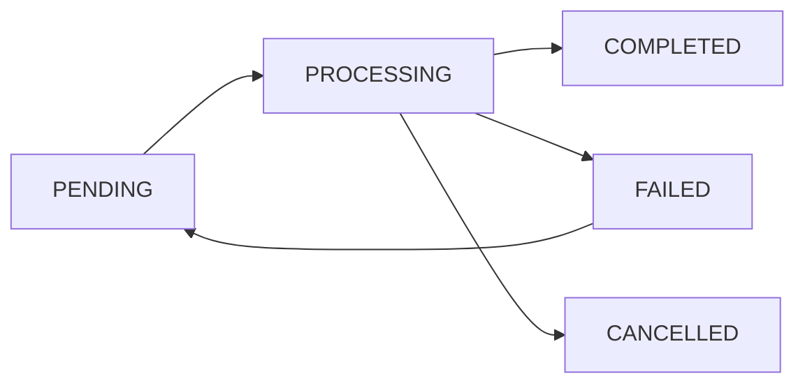

# 🎯 Task Monitoring System Design Principles

> Target architecture guideline: parts of the current implementation still use legacy `TaskStatus` and are being migrated.

> <details>
> <summary><strong>🤖 AI Assistant Guide</strong></summary>
>
> **Quick Reference**:
> This document outlines core principles and patterns for implementing task monitoring in Goldfinch's codebase.
> 
> **Core Rules**:
> 1. Every Celery task or background job MUST have a corresponding tracking table
> 2. Never use the generic TaskStatus table for new implementations
> 3. Always follow the common base structure for tracking tables
> 4. Implement proper error handling and retry mechanisms
> 5. Ensure proper monitoring and observability
> 
> ### 1. When to Create New Tracking
> - New Celery task implementation
> - New background job implementation
> - Feature requiring task status monitoring
> - Migration from legacy TaskStatus table
> 
> ### 2. Implementation Steps
> 1. Create domain-specific tracking table
>    - Include all standard fields
>    - Add domain-specific fields
>    - Set up proper constraints and indexes
> 2. Implement tracking service
>    - Extend BaseTaskTrackingService
>    - Add domain-specific methods
> 3. Update task implementation
>    - Create tracking record before task
>    - Update status throughout execution
>    - Handle errors properly
> 
> ### 3. Special Cases
> #### When Principles Don't Fit
> 1. For extremely simple, non-critical tasks:
>    - Document why principles aren't followed
>    - Get approval for deviation
>    - Implement minimal tracking if needed
> 
> 2. For rapid prototypes:
>    - Follow principles but mark as temporary
>    - Create tech debt ticket for proper implementation
>    - Set timeline for cleanup
> 
> 3. For external system integration:
>    - Adapt principles to match external constraints
>    - Document adaptations and reasons
>    - Maintain as much alignment as possible
> 
> ### 4. Workflow
> #### When Starting New Task Implementation:
> 1. Check if domain has existing tracking
> 2. Review domain-specific requirements
> 3. Create tracking table and service
> 4. Implement task with tracking
> 
> #### When Modifying Existing Tasks:
> 1. Check current tracking implementation
> 2. Plan migration if using legacy tracking
> 3. Update tracking to match principles
> 4. Maintain backward compatibility
> 
> #### When Handling Technical Debt:
> 1. Identify legacy implementations
> 2. Create migration plan
> 3. Update documentation
> 4. Implement proper tracking
> </details>

## 1. Overview

### Purpose and Goals
This document outlines the core design principles and implementation patterns for Goldfinch's task monitoring system. The system provides a standardized way to track, monitor, and manage background tasks and long-running operations.

### System Components
- Domain-specific tracking tables
- Base models and services
- Shared utilities and monitoring
- Task management and error handling

### When to Use Task Tracking
- Long-running operations (ETF updates, data processing)
- Scheduled tasks (daily updates, contribution processing)
- Background jobs with state management
- Operations requiring audit trails

## 2. Core Concepts

### 2.1 Domain Separation
- Each major feature requiring task monitoring gets its own tracking table
- Tables are focused on their specific domain needs
- No cross-domain dependencies in tracking tables
- Clear naming convention: `{domain}_task_tracking`

### 2.2 Status Management
Standard status flow:


Status definitions:
- `PENDING`: Task is queued but not started
- `PROCESSING`: Task is currently being executed
- `COMPLETED`: Task finished successfully
- `FAILED`: Task encountered an error
- `CANCELLED`: Task was manually or automatically cancelled

### 2.3 Base Structure
Every tracking table MUST include these core fields:
```sql
CREATE TABLE {domain}_task_tracking (
    id SERIAL PRIMARY KEY,
    status VARCHAR(20) NOT NULL,  -- pending, processing, completed, failed
    created_at TIMESTAMP NOT NULL DEFAULT NOW(),
    updated_at TIMESTAMP NOT NULL DEFAULT NOW(),
    started_at TIMESTAMP,
    completed_at TIMESTAMP,
    error_message TEXT,
    attempts INTEGER NOT NULL DEFAULT 0,
    max_attempts INTEGER NOT NULL DEFAULT 3,
    celery_task_id VARCHAR(255)
);

-- Required indexes
CREATE INDEX idx_{domain}_task_status ON {domain}_task_tracking(status);
CREATE INDEX idx_{domain}_task_dates ON {domain}_task_tracking(created_at, completed_at);
```

### 2.4 Monitoring & Observability
Built-in monitoring capabilities:
- Task duration tracking
- Success/failure metrics
- Retry counting
- Error tracking
- Performance monitoring

### 2.3 Task Dependencies and Relationships
Tasks can have dependencies or relationships with other tasks. These are handled through:
- Metadata field in tracking tables for storing dependency information
- Parent-child relationships between tasks
- Sequential task execution order

Example dependency patterns:
- Prerequisites: Tasks that must complete before another can start
- Parent-Child: Tasks that are part of a larger operation
- Chains: Series of tasks that must execute in sequence

## 3. Base Implementation

### 3.1 Models & Schemas

#### Base Model
```python
from datetime import datetime
from typing import Optional
from sqlalchemy import Column, Integer, String, DateTime, Text
from app.db.base_class import Base

class BaseTaskTracking(Base):
    """Base model for all task tracking tables"""
    __abstract__ = True
    
    id = Column(Integer, primary_key=True)
    status = Column(String(20), nullable=False)
    created_at = Column(DateTime, nullable=False, default=datetime.utcnow)
    updated_at = Column(DateTime, nullable=False, default=datetime.utcnow)
    started_at = Column(DateTime)
    completed_at = Column(DateTime)
    error_message = Column(Text)
    attempts = Column(Integer, nullable=False, default=0)
    max_attempts = Column(Integer, nullable=False, default=3)
    celery_task_id = Column(String(255))
```

#### Base Schemas
```python
from pydantic import BaseModel
from datetime import datetime
from typing import Optional

class TaskTrackingBase(BaseModel):
    status: str
    celery_task_id: Optional[str] = None
    max_attempts: int = 3

class TaskTrackingCreate(TaskTrackingBase):
    pass

class TaskTrackingUpdate(TaskTrackingBase):
    error_message: Optional[str] = None
    attempts: Optional[int] = None

class TaskTrackingInDB(TaskTrackingBase):
    id: int
    created_at: datetime
    updated_at: datetime
    started_at: Optional[datetime]
    completed_at: Optional[datetime]
    attempts: int
    error_message: Optional[str]

    class Config:
        orm_mode = True
```

### 3.2 Services

#### Base Service
```python
from datetime import datetime
from typing import Optional, Type, Any
from sqlalchemy.ext.asyncio import AsyncSession

class BaseTaskTrackingService:
    """Base service for all task tracking operations"""
    def __init__(self, db: AsyncSession, model: Type[BaseTaskTracking]):
        self.db = db
        self.model = model
    
    async def create_tracking(self, **kwargs) -> int:
        """Create a new task tracking record"""
        tracking = self.model(
            status="PENDING",
            created_at=datetime.utcnow(),
            **kwargs
        )
        self.db.add(tracking)
        await self.db.commit()
        return tracking.id
    
    async def update_status(
        self,
        tracking_id: int,
        status: str,
        error_message: Optional[str] = None
    ) -> None:
        """Update task status and related fields"""
        tracking = await self.db.get(self.model, tracking_id)
        if not tracking:
            return
        
        tracking.status = status
        tracking.updated_at = datetime.utcnow()
        
        if status == "PROCESSING":
            tracking.started_at = datetime.utcnow()
        elif status in ["COMPLETED", "FAILED"]:
            tracking.completed_at = datetime.utcnow()
        
        if error_message:
            tracking.error_message = error_message
            tracking.attempts += 1
        
        await self.db.commit()
```

### 3.3 CRUD Operations

#### Base CRUD
```python
from typing import Optional, List
from app.crud.base import CRUDBase
from app.models.base_task_tracking import BaseTaskTracking
from app.schemas.task_tracking import TaskTrackingCreate, TaskTrackingUpdate

class BaseTaskTrackingCRUD(CRUDBase[BaseTaskTracking, TaskTrackingCreate, TaskTrackingUpdate]):
    """Base CRUD operations for task tracking"""
    
    async def get_by_status(
        self, 
        db: AsyncSession, 
        status: str,
        skip: int = 0,
        limit: int = 100
    ) -> List[BaseTaskTracking]:
        """Get tasks by status"""
        return await db.execute(
            select(self.model)
            .where(self.model.status == status)
            .offset(skip)
            .limit(limit)
        )
    
    async def get_active_tasks(
        self,
        db: AsyncSession
    ) -> List[BaseTaskTracking]:
        """Get all tasks that are either pending or processing"""
        return await db.execute(
            select(self.model)
            .where(self.model.status.in_(["PENDING", "PROCESSING"]))
        )
```

### 3.4 Shared Utilities

#### Status Management
```python
from app.utils.task_tracking import (
    update_task_status,
    handle_task_error,
    retry_with_backoff
)

@celery_app.task(bind=True)
async def domain_task(self, tracking_id: int):
    try:
        # Updates status and timestamps
        await update_task_status(tracking_id, "PROCESSING")
        
        # Your task logic here
        
        await update_task_status(tracking_id, "COMPLETED")
    except Exception as e:
        # Handles error logging, status update, and retry logic
        await handle_task_error(self, tracking_id, e)
```

#### Monitoring Integration
```python
from app.monitoring.task_metrics import (
    track_task_duration,
    increment_task_counter,
    record_task_error
)

@track_task_duration("domain_task")
async def domain_task():
    increment_task_counter("domain_task", "started")
    try:
        # Task logic
        increment_task_counter("domain_task", "completed")
    except Exception as e:
        record_task_error("domain_task", str(e))
        raise
```

## 4. Domain Implementation Guide

### 4.1 Required Components

Each domain needs to implement:

1. **Domain-Specific Table**:
   - Inherit from `BaseTaskTracking`
   - Add domain-specific fields
   - Add domain-specific constraints/indexes
   - Use metadata field for dependency/relationship tracking

2. **Domain Service**:
   - Inherit from `BaseTaskTrackingService`
   - Add domain-specific methods
   - Implement dependency validation if needed
   - Handle task cancellation logic

3. **Domain CRUD**:
   - Inherit from `BaseTaskTrackingCRUD`
   - Add domain-specific query methods
   - Use inherited standard CRUD operations
   - Include methods for dependency and cancellation management

4. **Task Implementation**:
   - Use shared utilities for status/error handling
   - Focus on domain-specific logic
   - Use inherited monitoring integration

### 4.2 Step-by-Step Guide

1. **Planning**
   - Identify task requirements
   - Define domain-specific fields
   - Plan error handling strategy

2. **Implementation**
   - Create tracking table
   - Implement service and CRUD
   - Create task implementation
   - Add monitoring integration

3. **Testing**
   - Unit test domain logic
   - Integration test with task system
   - Verify monitoring

4. **Deployment**
   - Database migration
   - Service deployment
   - Monitoring setup

### 4.3 Examples

#### Simple Task: ETF Price Update
```python
# Table
class ETFPriceUpdateTracking(BaseTaskTracking):
    __tablename__ = "etf_price_update_tracking"
    
    etf_id = Column(String, ForeignKey("etfs.id"))
    date = Column(Date, nullable=False)
    price = Column(Numeric(20, 6))
    source = Column(String)

# Service
class ETFPriceUpdateService(BaseTaskTrackingService):
    async def create_price_update(self, etf_id: str, date: date) -> int:
        return await self.create_tracking(
            etf_id=etf_id,
            date=date
        )

# Task
@celery_app.task(bind=True)
async def update_etf_price(self, tracking_id: int):
    service = ETFPriceUpdateService(db)
    try:
        await service.update_status(tracking_id, "PROCESSING")
        # Price update logic
        await service.update_status(tracking_id, "COMPLETED")
    except Exception as e:
        await service.update_status(tracking_id, "FAILED", str(e))
        raise self.retry(exc=e)
```

#### Complex Task: Contribution Processing
```python
# Table
class ContributionRealizationTracking(BaseTaskTracking):
    __tablename__ = "contribution_realization_tracking"
    
    pension_id = Column(Integer, ForeignKey("pension_etfs.id"))
    contribution_date = Column(Date, nullable=False)
    amount = Column(Numeric(20, 2))
    currency = Column(String(3))
    metadata = Column(JSONB)

# Service
class ContributionTrackingService(BaseTaskTrackingService):
    async def create_contribution_tracking(
        self,
        pension_id: int,
        amount: Decimal,
        date: date
    ) -> int:
        return await self.create_tracking(
            pension_id=pension_id,
            contribution_date=date,
            amount=amount,
            currency="EUR"
        )

# Task
@celery_app.task(bind=True)
async def process_contribution(self, tracking_id: int):
    service = ContributionTrackingService(db)
    try:
        await service.update_status(tracking_id, "PROCESSING")
        # Complex contribution logic
        await service.update_status(tracking_id, "COMPLETED")
    except Exception as e:
        await service.update_status(tracking_id, "FAILED", str(e))
        raise self.retry(exc=e)
```

## 5. API Integration

### REST Endpoints
```python
from fastapi import APIRouter, Depends
from app.api.deps import get_db

router = APIRouter()

@router.post("/tasks/{domain}")
async def create_task(
    domain: str,
    data: TaskCreate,
    db: AsyncSession = Depends(get_db)
):
    service = get_domain_service(domain, db)
    tracking_id = await service.create_tracking(**data.dict())
    return {"tracking_id": tracking_id}

@router.get("/tasks/{domain}/{tracking_id}")
async def get_task_status(
    domain: str,
    tracking_id: int,
    db: AsyncSession = Depends(get_db)
):
    service = get_domain_service(domain, db)
    return await service.get_status(tracking_id)
```

## 6. Testing & Validation

### Unit Tests
```python
async def test_contribution_tracking_service():
    service = ContributionTrackingService(db)
    tracking_id = await service.create_contribution_tracking(
        pension_id=1,
        amount=Decimal("100.00"),
        date=date.today()
    )
    
    tracking = await service.get_status(tracking_id)
    assert tracking.status == "PENDING"
    
    await service.update_status(tracking_id, "PROCESSING")
    tracking = await service.get_status(tracking_id)
    assert tracking.started_at is not None
```

### Integration Tests
```python
async def test_contribution_processing():
    tracking_id = await process_contribution.delay(
        pension_id=1,
        amount=100.00,
        date="2024-03-01"
    )
    
    # Wait for task completion
    await wait_for_task(tracking_id)
    
    tracking = await ContributionTrackingService(db).get_status(tracking_id)
    assert tracking.status == "COMPLETED"
    assert tracking.completed_at is not None
```

## 7. Best Practices

### Task Creation
- Always create tracking record before task
- Use transactions when creating related records
- Set reasonable retry limits
- Include sufficient metadata for debugging
- Document task dependencies and relationships
- Implement proper cancellation cleanup

### Task Dependencies
- Store dependency information in metadata
- Validate dependencies before task execution
- Handle dependency failures gracefully
- Maintain clear documentation of task relationships
- Consider using task groups for related operations

### Task Cancellation
- Implement proper resource cleanup
- Handle in-progress task cancellation
- Update dependent tasks appropriately
- Log cancellation reasons
- Consider automatic cancellation for stale tasks

### Error Handling
- Log detailed error messages
- Implement exponential backoff for retries
- Handle edge cases (timeouts, partial completion)
- Maintain audit trail of failures

### Data Management
- Regular cleanup of completed tasks (>30 days)
- Maintain indexes for common queries
- Implement data retention policies
- Regular performance review of queries

## 8. Troubleshooting

### Common Issues
1. **Task Stuck in Processing**
   - Check Celery worker status
   - Verify task hasn't exceeded timeout
   - Check for deadlocks

2. **High Failure Rate**
   - Monitor error patterns
   - Check external dependencies
   - Verify retry configuration

3. **Performance Issues**
   - Review index usage
   - Check query patterns
   - Monitor database load

### Debugging Guide
1. Check task status and history
2. Review error messages
3. Verify monitoring metrics
4. Check system resources
5. Review related tasks

## 9. Migration Guide

### From Legacy TaskStatus
1. Create new domain-specific tracking table
2. Implement new service and CRUD
3. Migrate existing data
4. Update task implementations
5. Verify and cleanup

### Data Migration Example
```python
async def migrate_legacy_tasks():
    """Migrate from TaskStatus to domain-specific tracking"""
    old_tasks = await db.execute(
        select(TaskStatus).where(
            TaskStatus.task_type == "domain_specific"
        )
    )
    
    for task in old_tasks:
        await DomainTrackingService(db).create_tracking(
            status=task.status,
            created_at=task.created_at,
            error_message=task.error,
            metadata=task.task_metadata
        )
``` 
